# Prompt Engine（PE）設計書

| 項目 | 内容 |
|---|---|
| ドキュメントID | PE-DESIGN-001 |
| バージョン | 1.0.0 |
| ステータス | Draft |
| 位置付け | AACP / CIAP / APAP と並ぶ独立共通基盤の設計書 |

**関連基盤と責務分離**

| 共通基盤 | 責務 | PEとの関係 |
|---|---|---|
| AACP | Agent実行・ワークフロー・タスク管理 | PEのクライアント（Prompt取得・実行依頼元） |
| CIAP | 認証・認可・ユーザー管理 | PEの全APIはCIAP発行トークンで認可 |
| APAP | AI Provider/Model抽象化・ルーティング | PEのExecution StageはAPAP経由でのみモデル呼出 |
| **PE** | **Prompt資産管理・Template・評価・最適化** | 本書の対象 |

PEはAIモデル・Providerを一切内包しない。実行はAPAPへの委譲であり、PEの関心は「何をどう指示するか」の資産化・品質管理に限定される。

---

# 1. 要件定義

## 1.1 概要

Prompt Engine（PE）は、AIシステム全体で利用するPromptの作成・合成・検証・最適化・レンダリング・実行連携・評価・監査を一元管理する共通基盤である。Promptをソースコードではなくバージョン管理された「リソース」（Prompt as Resource / Prompt as Code）として扱い、ライフサイクル（Draft→Review→Approved→Published→Deprecated→Archived）全体を管理する。

## 1.2 目的

| 目的 | 実現手段 |
|---|---|
| 再利用性 | Template / Fragment / Composition / Import による部品化 |
| 品質向上 | Validation / Review / Approval / Evaluation / Experiment |
| 保守性 | Version管理 / Diff / Rollback / Dependency管理 |
| 可観測性 | Metrics / Tracing / Audit Log / Monitoring |
| 拡張性 | Plugin Architecture（Engine / Resolver / Rule / Formatter 差替可能） |
| モデル非依存 | Provider Independent DSL、APAP経由の抽象実行 |

## 1.3 背景

Promptがアプリケーションコード内に散在すると、(a) 変更にデプロイが必要、(b) 品質が属人化、(c) A/Bテスト不能、(d) モデル変更時の影響範囲が不明、という問題が生じる。PEはPromptをコードから分離し、ガバナンスの効いた共有資産として管理する。

## 1.4 適用範囲

- Promptのライフサイクル全体（作成〜アーカイブ）
- Prompt Pipeline（Load〜Audit の12ステージ）
- Template / Fragment / Variable / Context の管理
- 評価・実験（A/B / Canary / Benchmark）
- 監査・監視・検索・メタデータ管理

**利用元システム**: AI Agent（AACP）、Workflow Engine、Backend API、Web / Mobile / Desktop Application、IoT、CLI、Batch、管理システム。

## 1.5 対象外

| 対象外 | 担当基盤 |
|---|---|
| AIモデル・Provider実装、ルーティング | APAP |
| 認証・認可の実装 | CIAP |
| Workflow Engine / AI Agent本体 | AACP |
| 業務ロジック / 画面設計 | 各アプリケーション |

## 1.6 利用シナリオ

| ID | シナリオ | 流れ |
|---|---|---|
| SC-01 | アプリからのPrompt利用 | アプリはPromptKey+変数のみ指定 → PEが解決・Render済Promptを返却 → アプリがAPAP経由で実行（または実行委譲） |
| SC-02 | Prompt改善サイクル | 新Version作成（Draft）→ Validation → Review → Approval → Canary配信 → 評価比較 → Published昇格 or Rollback |
| SC-03 | A/Bテスト | 2 Variantを定義 → トラフィック分割 → Quality/Cost/Latency比較 → 勝者Publish |
| SC-04 | モデル移行 | Prompt本体は不変、Model Profile別のOptimization/Rendering設定のみ追加 → Benchmarkで回帰確認 |
| SC-05 | 監査対応 | 誰がいつどのPromptを変更・実行したかをAudit Logで追跡、実行時点のVersion内容を再現 |
| SC-06 | 共通Fragment更新 | 安全ポリシーFragmentを更新 → Dependency Managerが依存Prompt一覧を提示 → 影響Promptを再評価 |

## 1.7 ユースケース

| ID | アクター | ユースケース | 事前条件 | 事後条件 |
|---|---|---|---|---|
| UC-01 | Prompt Engineer | Promptを新規作成する | 編集権限 | Draft Version生成、PromptCreated発火 |
| UC-02 | Prompt Engineer | Template/Fragmentを合成する | 参照先がPublished | 依存グラフ登録 |
| UC-03 | Prompt Engineer | Promptを検証する | Draft存在 | ValidationReport生成 |
| UC-04 | Reviewer | Promptをレビューする | Review依頼済 | Approve/Reject記録 |
| UC-05 | Approver | Promptを承認・公開する | Review通過 | Published、PromptPublished発火 |
| UC-06 | Client System | Renderされたpromptを取得する | Published Version存在 | RenderedPrompt返却 |
| UC-07 | Client System | Prompt実行を委譲する | APAP接続可 | Response+ParsedOutput返却、PromptExecuted発火 |
| UC-08 | Prompt Engineer | A/Bテストを実施する | 2 Variant存在 | ExperimentResult記録 |
| UC-09 | Prompt Engineer | Rollbackする | 過去Version存在 | Published差替、PromptRolledBack発火 |
| UC-10 | Auditor | 監査ログを検索する | 監査権限 | AuditLog一覧取得 |
| UC-11 | Operator | メトリクスを監視する | 監視権限 | Token/Cost/Latency/成功率参照 |
| UC-12 | Prompt Engineer | Promptをimport/exportする | 権限 | DSLファイル入出力 |

## 1.8 機能要件

| ID | 分類 | 要件 |
|---|---|---|
| FR-001 | Repository | Prompt/Template/FragmentのCRUD、論理削除、複製 |
| FR-002 | Versioning | 全変更でImmutableなVersion生成、SemVer、履歴、Diff、Rollback |
| FR-003 | Lifecycle | Draft/Review/Approved/Published/Deprecated/Archived の状態管理と遷移制約 |
| FR-004 | Template | パラメータ定義付きTemplate、継承（extends）、デフォルト値 |
| FR-005 | Fragment | 再利用可能な部分Prompt、Include/Importによる参照 |
| FR-006 | Composition | Include / Import / Macro / Inheritance / Nested Prompt、循環参照検出 |
| FR-007 | Variable | Static/Runtime/Secret/Environment/User/Workflow の6種を統一抽象で解決 |
| FR-008 | Context | System/User/Conversation/Workflow/Application/Memory/Environment の7 Contextを解決・注入 |
| FR-009 | Validation | Schema/Placeholder/Parameter/Length/Policy検証、Rule Plugin追加可 |
| FR-010 | Optimization | Token最適化、Compression、Expansion、Model Profile別最適化 |
| FR-011 | Rendering | Template Engine差替可能、決定的Render（同一入力→同一出力） |
| FR-012 | Output | JSON/XML/Markdown/Text/Structured Output のFormatter・Parser |
| FR-013 | Execution連携 | APAP Adapter経由の実行委譲（PE自体はProvider非依存） |
| FR-014 | Evaluation | Prompt Quality/Response Quality/Latency/Token/Cost/Consistency/Determinism |
| FR-015 | Experiment | A/B Test、Canary、Benchmark、トラフィック分割、統計判定 |
| FR-016 | Review/Approval | レビューコメント、承認ワークフロー、4-eyes原則設定可 |
| FR-017 | Search | 全文検索、Tag/Category/Metadata/Status絞り込み（**M1では全文検索が`ILIKE`部分一致のフォールバックのみ**。Tag/Category/Status絞り込みは実装済。Issue #84） |
| FR-018 | Dependency | Fragment/Template依存グラフ、影響分析、循環検出 |
| FR-019 | Import/Export | DSLファイル（YAML+Template）の入出力、バンドル |
| FR-020 | Audit | 全変更・全実行の監査ログ（改竄不可・追記専用） |
| FR-021 | Monitoring | Metrics（Token/Cost/Latency/成功率）、分散Tracing |
| FR-022 | Cache | Prompt/Render結果キャッシュ、Version更新時の無効化 |
| FR-023 | Event | 全状態変化のDomain Event発行（Event Bus） |
| FR-024 | Plugin | 拡張ポイント（§16）へのPlugin登録・活性化・隔離 |

## 1.9 非機能要件

| ID | 分類 | 要件 | 目標値 |
|---|---|---|---|
| NFR-001 | 可用性 | 24時間365日稼働、Read系はキャッシュで縮退継続 | 99.9%（Read 99.99%） |
| NFR-002 | 性能 | Prompt取得（キャッシュヒット） | p99 ≤ 20ms（M2-3で`PromptCache`（§16拡張ポイント#9、Redis実装）を実装。P11のNFR-003測定手順・条件を踏襲した再測定でEnd-to-End p99=78.14ms（目標200ms達成、キャッシュ無し時80.03msから改善）を確認したが、Mergeステージ単体を分離したp99≤20msの直接測定は計装（Micrometer Timerの`publishPercentileHistogram`）が無く未達成。詳細はREADME「性能測定」節・ADR-0033参照） |
| NFR-003 | 性能 | Render（Validation含む、実行除く） | p99 ≤ 200ms |
| NFR-004 | 拡張性 | 水平スケール（ステートレスAPI）、Plugin追加は再起動不要 | - |
| NFR-005 | セキュリティ | CIAP連携（OIDC/OAuth2）、RBAC+スコープ、Secretは参照のみ保持しSecret Managerへ委譲、Render結果ログにSecretをマスク | - |
| NFR-006 | 監査 | Audit Logは追記専用・保持期間設定可（既定7年）（**M1では追記専用性をアプリケーション層のRepository Interfaceでのみ担保し、DB層でのGRANT/REVOKE等の強制は未実装。保持期間設定も未実装**。Issue #85） | - |
| NFR-007 | 保守性 | Clean Architecture、モジュール間はInterface依存のみ | - |
| NFR-008 | 可観測性 | OpenTelemetry互換のTrace/Metrics/Log出力 | - |
| NFR-009 | データ整合 | Command系は強整合、Read Model/検索Indexは結果整合（遅延≤5s） | - |
| NFR-010 | 互換性 | DSL/APIは後方互換、破壊的変更はメジャーバージョンのみ | - |

---

# 2. システム仕様

## 2.1 全体構成

```
+-----------------------------------------------------------------------+
| Clients: AACP Agent / Workflow / Backend / Web / Mobile / Desktop /   |
|          IoT / CLI / Batch / 管理システム                               |
+------------------------------+----------------------------------------+
                               | REST / gRPC / SDK   (認可: CIAP)
+------------------------------v----------------------------------------+
| Interface Layer   : Prompt API (Command API / Query API / Admin API)  |
+------------------------------+----------------------------------------+
| Application Layer : UseCase / Command Handler / Query Handler /       |
|                     Pipeline Orchestrator / Event Publisher           |
+------------------------------+----------------------------------------+
| Domain Layer      : Prompt / Template / Variable / Context /          |
|                     Evaluation / Experiment / Governance (Aggregates) |
+------------------------------+----------------------------------------+
| Engine Layer      : Prompt Core / Template Engine / Render Engine /   |
|   (Domain Service) Variable Resolver / Context Resolver / Validation  |
|                     / Optimization / Evaluation / Experiment /        |
|                     Compiler / Parser / Plugin Manager                |
+------------------------------+----------------------------------------+
| Infrastructure    : Repository(RDB) / Event Store / Cache / Search    |
|                     Index / Object Storage / Secret Manager Adapter / |
|                     APAP Adapter / CIAP Adapter / Event Bus /         |
|                     Observability Exporter                            |
+-----------------------------------------------------------------------+
```

## 2.2 アーキテクチャ方針

| 方針 | 適用 |
|---|---|
| Clean Architecture | 依存方向は外→内。DomainはInfrastructureを知らない |
| DDD | 6 Bounded Context（§4.7）、Aggregate単位のトランザクション |
| CQRS | Command（更新）とQuery（参照・検索）を分離。Read Modelは投影で構築 |
| Event Sourcing（考慮） | Prompt Aggregateの変更はDomain EventとしてEvent Storeへ追記。現在状態はSnapshot+リプレイで復元可能。Read側はRDB投影 |
| Event Driven | 全状態変化をEvent Busへ発行、Audit/Search/Monitoring/通知は購読側で処理 |
| Plugin Architecture | Engine類はInterface + Registry。実装はPluginとして注入 |
| Cloud Native | ステートレスコンテナ、12-Factor、宣言的構成、水平スケール |
| SOLID | Interface分離（§3.4）、Strategy/Policyによる開放閉鎖 |

## 2.3 レイヤ構成と責務

| レイヤ | 責務 | 依存先 |
|---|---|---|
| Interface | プロトコル変換、DTO、認可チェック（CIAP）、レート制御 | Application |
| Application | UseCase調整、トランザクション境界、Pipeline起動、Event発行 | Domain |
| Domain | ビジネスルール、Aggregate不変条件、Domain Service Interface | なし（純粋） |
| Engine | Domain Serviceの実装群（Render/Validate/Optimize等） | Domain Interface |
| Infrastructure | 永続化、外部連携（APAP/CIAP/Secret/Search/Cache/Bus） | Domain Interface実装 |

## 2.4 モジュール構成・責務一覧

| モジュール | 責務 | 主要依存 |
|---|---|---|
| Prompt Core | Pipeline全体の統括。ステージ実行順序・エラー処理・トレース | 全Engine |
| Template Engine | DSL構文の展開（プレースホルダ、制御構文、継承）。Plugin差替可 | Parser |
| Render Engine | 最終Prompt文字列/メッセージ列の組立、Output Format指示注入 | Template Engine |
| Prompt Parser | DSLテキスト→AST変換、構文エラー報告 | - |
| Prompt Compiler | AST→実行可能CompiledPrompt（参照解決済・検証済）への変換、キャッシュ | Parser, Dependency Manager |
| Variable Resolver | 6種Variableの解決。Resolver Chain（§2.9） | Secret Adapter等 |
| Context Resolver | 7種Contextの解決・マージ（§2.8） | Context Provider Plugin |
| Validation Engine | Rule Chainによる検証、ValidationReport生成 | Rule Plugin |
| Optimization Engine | Token見積・圧縮・展開。Model Profile適用 | Tokenizer Plugin |
| Evaluation Engine | 7指標の算出、Evaluator Plugin実行、スコア永続化 | Repository |
| Experiment Engine | Variant割当（トラフィック分割）、Canary制御、統計判定 | Evaluation Engine |
| Repository | Aggregate永続化、Event Store追記、Read Model投影 | RDB/Event Store |
| Prompt Cache | CompiledPrompt/Render結果のキャッシュ、Eventによる無効化 | Cache Store |
| Search Engine | 全文・ファセット検索。Indexer（Event購読）と Query | Search Index |
| Metadata Manager | Tag/Category/カスタムMetadataの管理 | Repository |
| Dependency Manager | 依存グラフ構築、循環検出、影響分析 | Repository |
| Version Manager | Version採番（SemVer）、Diff、Rollback | Repository |
| Audit Engine | Audit Event購読→追記専用ストアへ記録、検索API | Audit Store |
| Monitoring Engine | Metrics集計、Trace伝播、SLO監視 | OTel Exporter |
| Plugin Manager | Plugin登録・検証・活性化・隔離（失敗Pluginの遮断） | Plugin Registry |
| APAP Adapter | 実行委譲（Provider非依存のExecutionRequest変換） | APAP |
| CIAP Adapter | トークン検証・権限解決 | CIAP |

## 2.5 Promptライフサイクル

状態: `Draft → InReview → Approved → Published → Deprecated → Archived`（詳細図は§9）

| 遷移 | 操作 | 権限 | ガード条件 |
|---|---|---|---|
| (新規)→Draft | create / newVersion | prompt:write | - |
| Draft→InReview | submitForReview | prompt:write | Validation合格 |
| InReview→Draft | reject / withdraw | prompt:review | - |
| InReview→Approved | approve | prompt:approve | 必要承認数充足（既定1、設定可） |
| Approved→Published | publish | prompt:publish | 依存先が全てPublished（他Versionが現在Publishedの場合、そのVersionを自動的にDeprecatedへ遷移させるアトミック操作。ADR-0005） |
| Published→Published | rollback(過去Versionを再Publish) | prompt:publish | 対象Versionが存在 |
| Published→Deprecated | deprecate | prompt:publish | 代替Version推奨設定 |
| Deprecated→Archived | archive | prompt:admin | 参照クライアントゼロ確認（`execution_logs`のN日間ウィンドウ判定。cutoff前作成のVersionは判定不能のため`force=true`必須）or 強制フラグ |
| Draft→Archived | discard | prompt:write | - |

ルール: Published Versionの内容はImmutable。修正は必ず新Versionとして作成。1 Promptにつき「Published」は同時に1 Version（Experiment中はVariantとして複数配信可）。

`approve`の「必要承認数充足」について（M2-2、ADR-0032決定2/3）: 必要承認数はグローバル設定
（`promptengine.review.required-approvals`、既定1）を`submitForReview`時点で`ReviewCase`
（Governanceコンテキスト、§4.1・§4.3）へ複製・保存する値であり、以後この設定を変更しても
進行中の`ReviewCase`には遡及しない。4-eyes原則（作成者と承認者が別人であることの強制）は
`promptengine.review.allow-self-approval`（既定`false`）で制御し、こちらは複製せず`approve`
のたびに現在の設定値を読む。`InReview→Approved`遷移自体は`Prompt` Aggregateが実行するが、
対応するDomain Event（`PromptApproved`、§14）の発火元は`ReviewCase`である（ADR-0004）。

`archive`の「参照クライアントゼロ確認」について: P10bで`execution_logs`（本節下部・§12）への書き込み経路（`PromptExecuted`を購読する`ExecutionLogSubscriber`）が入り、「直近N日間に実行が無いこと」を自動確認できるようになった（[Issue #48](https://github.com/io0323/prompt-engine/issues/48)をクローズ、ADR-0026決定5）。判定は`prompt_versions.created_at`とカットオーバー時刻（`promptengine.archive.execution-logs-cutover-at`）の比較を伴う。

- カットオーバー**以降**に作られたVersion: 判定窓（`promptengine.archive.inactivity-threshold-days`、既定90日）に実行記録が無ければ`force`無しでarchiveできる。実行記録があれば拒否する。
- カットオーバー**以前**に作られたVersion: 判定不能として扱い、`force=false`のarchiveを**常に拒否する**（`ArchiveRequiresForceException`）。`force=true`が必須。**これらのVersionは恒久的にforce専用のまま残る。**
- `force=true`は判定によらず常に受け付ける（ガード自体を評価しない）。

判定結果と挙動の対応（`ArchiveEligibility`、ADR-0026決定5）:

| 判定 | 条件 | `force=false`での挙動 |
|---|---|---|
| `VersionNotFound` | 対象Versionが存在しない | `PromptVersionNotFoundException` |
| `PreCutover` | `prompt_versions.created_at` < cutoff | **拒否**（`ArchiveRequiresForceException`） |
| `RecentlyExecuted` | 判定窓に`execution_logs`の行がある | 拒否（`ArchiveRequiresForceException`） |
| `Inactive` | 判定窓に`execution_logs`の行が無い | **許可** |

**「実行記録が無い」と「一度も実行されていない」は区別できていない。** `execution_logs`への書き込みはcutoff以降にしか存在しないため、cutoff前に作成されたVersionについてこの2つは同じ「行が無い」状態として現れる。具体的には、現在の実装は以下の2つを**どちらも`PreCutover`として同じ扱い**（force必須）にする。

1. cutoff前に作成され、その後一度も実行されていない古いPrompt（＝本当に参照ゼロ。本来はforce無しでarchiveできてよい）
2. cutoff前に作成され、cutoff前は活発に実行されていたが記録が残っていないだけのPrompt（＝実際には参照されている可能性がある）

この2つを取り違えた場合の損害は非対称である。1を誤って拒否しても運用者が`force=true`を付け直すだけで済むが、2を誤って許可すると**現に参照されているPromptを警告なく落とす**。したがって判断不能は拒否側へfail closedさせる。cutoff以降に作成されたVersionについてはこの曖昧さは存在せず、「行が無い＝実行されていない」と結論できる。

## 2.6 Prompt Pipeline仕様

Pipelineは12ステージの直列実行。各ステージは `PipelineStage` Interface（§3.4）を実装し、`PipelineContext`（累積状態）を受け渡す。ステージ単位でTrace Span生成・所要時間記録。

| # | Stage | 入力 | 出力 | 失敗時 |
|---|---|---|---|---|
| 1 | Load | PromptKey, Version指定/latest | PromptVersion(DSL) | PROMPT_NOT_FOUND |
| 2 | Merge | PromptVersion + extends先Template | マージ済AST | TEMPLATE_NOT_FOUND |
| 3 | Import | @import/@include参照 | 参照解決済AST（循環検出） | CIRCULAR_DEPENDENCY / FRAGMENT_NOT_FOUND |
| 4 | Resolve Variables | AST + 呼出パラメータ | VariableBindingSet | VARIABLE_UNRESOLVED |
| 5 | Resolve Context | ContextRequirement宣言 | ContextBindingSet | CONTEXT_UNAVAILABLE（optional宣言なら継続） |
| 6 | Validation | AST + Bindings | ValidationReport | VALIDATION_FAILED（error severity時） |
| 7 | Optimization | 束縛済AST + ModelProfile | 最適化済AST + TokenEstimate | 警告のみで継続可（予算超過はTOKEN_BUDGET_EXCEEDED） |
| 8 | Rendering | 最適化済AST | RenderedPrompt（messages[] + format指示） | RENDER_ERROR |
| 9 | Execution | RenderedPrompt + ExecutionPolicy | RawResponse | EXECUTION_FAILED（APAPエラー透過） |
| 10 | Response Parsing | RawResponse + OutputSchema | ParsedOutput | PARSE_FAILED（リトライ/修復Policy適用可） |
| 11 | Evaluation | ParsedOutput + 指標設定 | EvaluationResult（非同期可） | 記録のみ、本流は失敗させない |
| 12 | Audit | 全ステージ記録 | AuditRecord | 必須。失敗時はDLQ退避 |

**実行モード**: (a) Render-only（1〜8。クライアントが自分で実行）、(b) Full-execution（1〜12。PEがAPAP経由で実行委譲）、(c) Compile-only（1〜3+6。CI検証用）。

`ExecutionPolicy`/`RawResponse`/`OutputSchema`/`ParsedOutput`の具体的な型定義、リトライ対象エラーの
分類（`ExecutionErrorType`、タイムアウトを接続確立前/応答待機中で区別）、parseRepairの既定値・
再実行方式、リトライ責務の暫定境界（M1はPE側で一元化、M2でAPAPとの重複を再確認）はADR-0014を
参照。`OutputSchema`はM1では`output.schemaRef`（§15.1）から自動解決されず、呼出側が明示的に
渡す値である（DSLからの回収は[Issue #32](https://github.com/io0323/prompt-engine/issues/32)。
`outputFormat`側は`PromptVersion`/`CompiledPrompt`が`output: OutputDeclaration`として保持する
形でP8が回収した。`schemaRef`から実際の`OutputSchema`を解決する経路は依然として無く、
[Issue #36](https://github.com/io0323/prompt-engine/issues/36)で追跡する）。

`PipelineContext`/`PipelineStage`/`PipelineMode`の具体的な型定義、ステージ⇔エラーコード対応表、
`EventBusAdapter`/`AuditRecord`/`AuditRepository`/`AuditFailureHandler`の最小実装方針、
Pipeline Orchestratorのレイヤ配置（`prompt-engine-application`、ADR-0014決定6の修正を含む）は
ADR-0015を参照。

## 2.7 Context Flow

Contextは名前空間付きの読み取り専用データとしてPromptから `{{ context.<scope>.<path> }}` で参照する。

| Scope | 内容 | 供給元 | ライフタイム |
|---|---|---|---|
| system | 基盤共通指示（安全ポリシー、日付、ロケール） | PE設定 + System Context Provider | リクエスト |
| user | 利用者属性（表示名、権限、嗜好） | CIAP / 呼出元 | リクエスト |
| conversation | 対話履歴（直近N件、要約） | Conversation Context Provider（呼出元供給） | 会話 |
| workflow | ワークフロー実行状態・前段出力 | AACP / 呼出元 | ワークフロー実行 |
| application | 呼出アプリ固有設定 | 呼出元 | リクエスト |
| memory | 長期記憶（要約・知識） | Memory Context Provider（呼出元供給） | 永続（供給側管理） |
| environment | 実行環境（env名、リージョン、feature flag） | PE環境設定 | デプロイ |

マージ順序（後勝ち）: `environment → system → application → workflow → user → memory → conversation`。衝突はスコープ名前空間で原則発生しない。Promptは必要ContextをDSLで宣言し（`context.required` / `context.optional`）、未宣言スコープへの参照はValidationエラー。

## 2.8 Variable Resolution

Resolver Chain: `Explicit Parameter → Static → User → Workflow → Environment → Secret`。同名変数は先勝ち（明示パラメータ最優先）。

| 種別 | 定義場所 | 解決タイミング | 備考 |
|---|---|---|---|
| Static | Prompt DSL内 defaults | Compile時 | 定数・既定値 |
| Runtime | 呼出パラメータ | 実行時 | Schema検証必須 |
| Secret | Secret Manager参照名のみDSLに記載 | Render直前 | ログ・キャッシュ・Audit全てマスク。Render結果キャッシュ禁止 |
| Environment | 環境設定 | 起動/実行時 | env毎に差替 |
| User | Userスコープストア/呼出元 | 実行時 | CIAP Subject単位 |
| Workflow | AACPから受領 | 実行時 | workflow実行ID単位 |

全Variableは `type`（string/number/boolean/enum/array/object）、`source`（static/runtime/secret/environment/user/workflow）、`required`、`default`、`constraints`（pattern/min/max/enum値）、`sensitive` を宣言する（§15.2）。`source == secret` の変数は必ず `sensitive == true` でなければならない（ADR-0011）。

## 2.9 Rendering仕様

- Template EngineはPlugin（既定: PE標準エンジン `pe-tmpl/1`）。
- 決定性: 同一（AST, Bindings, ModelProfile, EngineVersion）→ バイト同一出力。乱数・現在時刻はContext経由でのみ注入可。
- 出力は `RenderedPrompt { messages: [{role, content}], outputFormat, tokenEstimate, renderHash }`。roleは system/user/assistant/tool の抽象role（`BlockNode`が持つDSL上のrole、system/user/assistantの3値とは別レイヤーの型。Provider方言はAPAPが吸収）。`modelHints`はM1では持たない（APAP連携が具体化するP7以降で追加を検討する、ADR-0013決定6）。
  `renderHash`の正規化規則・`BlockNode`→`messages`変換規則・非決定性要因の構造的排除方針はADR-0013を参照。
  `OutputFormatter.instruction(outputSchema)`によるフォーマット指示文の`messages`への注入経路
  （既存system messageへの追記／無ければ新規system message追加、その後renderHash算出）はP7で
  接続した（ADR-0014決定5）。

## 2.10 Validation仕様

Rule Chain（全Rule実行→Report集約。severity: error/warning/info）:

| Rule | 内容 |
|---|---|
| SchemaValidation | 呼出パラメータをVariable Schemaで検証 |
| PlaceholderValidation | 未束縛プレースホルダ・未使用変数の検出 |
| ParameterValidation | 型・制約（pattern/min/max/enum）検証 |
| LengthValidation | 文字数・推定Token数の上限検証 |
| PolicyValidation | 禁止語・PII混入・組織ポリシー準拠（Rule Plugin） |
| DependencyValidation | 参照Fragment/TemplateのStatus検証（Published以外の参照を拒否、Draft相互参照はCompile-onlyで許可） |

Rule Chainが受け取る「AST」は`CompiledPrompt.body`（P3c Composition解決済み、extends/import/
include/macro展開後）を指す。DSL内`validation:`宣言（§15.7）は`PromptVersion`/`CompiledPrompt`の
`validation: ValidationSettings`として保持し、`DependencyValidation`のStatus拒否自体はP3c
CompositionServiceが解決時点で行う（Validationは既に確定したStatusを報告するのみ、
リポジトリを再度引かない）。ValidationRule/Finding/ValidationEngineの具体的な型・
severity決定規則・各RuleのAST走査規則はADR-0012を参照。

## 2.11 Optimization仕様

| 手法 | 内容 | 適用条件 |
|---|---|---|
| Token Optimization | 冗長表現の正規化（空白・重複指示の削減） | 常時（無効化可） |
| Compression | 会話履歴・Contextの要約/切詰（優先度: conversation古い順→memory） | tokenEstimate > budget |
| Expansion | Few-shot例・詳細指示の追加（M1は詳細指示の追加のみ実装。Few-shot例の注入は例データの供給元が未設計のため対象外、ADR-0013・[Issue #29](https://github.com/io0323/prompt-engine/issues/29)） | ModelProfileが指示追従弱と定義する場合 |
| Context Optimization | 参照されないContextスコープの除去 | 常時 |

Model Profile（APAPのモデルメタデータを参照して構成）: `{ maxContextTokens, tokenizerPlugin, costPerToken, capabilities }`。`capabilities`の型・M1での要約(Compression)スコープ・OptimizationRule/OptimizationEngineの具体的な型定義はADR-0013を参照。Optimizationは意味保存が原則で、変更内容はOptimizationReportとしてAuditに残す。

## 2.12 Evaluation仕様

| 指標 | 算出方法 | タイミング |
|---|---|---|
| Prompt Quality | 静的評価（明確性・構造・アンチパターン検査。Evaluator Plugin、LLM-as-Judge可） | 保存時/任意 |
| Response Quality | 期待出力との一致度・Rubricスコア（Evaluator Plugin） | 実行後/オフライン |
| Accuracy | Golden Dataset正解率 | Benchmark時 |
| Consistency | 同一入力N回実行の出力類似度（埋め込み距離等、Plugin） | Benchmark時 |
| Determinism | 同一入力・temperature=0でのバイト一致率 | Benchmark時 |
| Latency | Execution Stage実測（p50/p95/p99） | 実行毎 |
| Token Usage / Cost | APAP応答のusage × Model Profile単価 | 実行毎 |

評価結果は PromptVersion に紐付くEvaluationRecordとして永続化し、Version間比較・Experiment判定に使用。

### M1実装（P10b、ADR-0026決定3）

実装済みの評価器は実行系の3種（Latency / Token Usage / Cost）。Quality系は`EvaluationRule`を実装したPluginとして後から追加できる（Engine側の変更を要さない）。評価は`PromptExecuted`を購読する非同期処理であり、Pipeline本流をブロックしない。

`evaluation_records`へ実際に記録される値は以下の通り。

| `metric_type` | `score` | `method` | 備考 |
|---|---|---|---|
| `Latency` | Stage 9（Execution）の実測ミリ秒 | `execution-stage-measured` | 本表の`Latency`行が言うp50/p95/p99は複数行を跨いだ集計（Monitoring側の責務）であり、1実行あたりは実測値をそのまま記録する |
| `TokenUsage` | `inputTokens + outputTokens` | `provider-usage` | 列値は空白なしの識別子。本節の表記「Token Usage」に対する実装上の正規化 |
| `Cost` | `(inputTokens + outputTokens) × costPerToken` | `usage-x-model-profile-rate` | 下記の単価の扱いを参照 |

- **単価は実行時点の値をイベントに載せて使う。** 購読側が評価時に`ModelProfile`を引き直すと、単価改定後に過去の実行を再評価した際に当時と異なるコストが算出されてしまうため。
- `ModelProfile.costPerToken`は入力・出力を区別しない単一のブレンド単価であり、プロバイダの入出力別レートは表現できない（本節の記述「usage × Model Profile単価」自体が単価を単数で書いているため矛盾はしないが、実課金との差異は残る）。
- **Latencyの取得元**は`PipelineContext.stageDurationsMs["Execution"]`。`PipelineOrchestrator`以外の経路で未計測の場合に限り、各試行の`RawResponse.latency`の合算へフォールバックする（Adapter実測の合計であり、Stage全体のdurationよりわずかに小さい）。
- `variant_id`はM2-4a（ADR-0034）でExperiment経由の実行のみ非NULLになる。通常経路（Experiment非対象）の実行では引き続き`NULL`。
- 同一イベントの再配信では`(event_id, metric_type)`の一意制約により行が二重にならず、その場合は`PromptEvaluationCompleted`を**再発行しない**（下流へ完了イベントが増殖するのを避けるため）。

`execution_logs`（§12）についてもM1固有の制約がある。

- `status`は**常に`SUCCESS`**。`execution_logs`を書く`ExecutionLogSubscriber`が購読する`PromptExecuted`は、Stage 9が成功しStage 11まで到達した場合にしか発火しない。実行失敗を表す`PromptExecutionFailed`（§14）はイベント定義のみ存在し、M1に発火元が無い。したがって現時点の`execution_logs`は**失敗した実行を含まない**（成功実行のみの母集団である点は、この表を集計に使う際の前提となる）。
- `caller_system`はイベントの`actor`を暫定的に写した値。呼出元クライアント識別情報をPipelineへ伝搬する経路がM1に存在しないため、真の呼出元システム名ではない。

### M2実装（Benchmark、ADR-0035）

Accuracy/Consistency/Determinismは`evaluation_records`/`EvaluationRule`とは別系統で実装する。`EvaluationRule.evaluate(execution: PromptExecutionSummary)`は1回の実行のメタデータのみを受け取る形であり、期待出力との比較（Accuracy）や複数回実行の比較（Consistency/Determinism）を表現できないため。新設の`Benchmark` Aggregate・`BenchmarkScoringRule`拡張点（§16-15）・`benchmark_item_results`テーブル（§12）で実装する。`Experiment`（§4.3）とは別Aggregateであり、`experiments`/`variants`/`evaluation_records`テーブルへの変更は無い。詳細はADR-0035。

## 2.13 Version管理仕様

- 採番: SemVer。breaking（変数追加required化・出力Schema変更）=major、機能追加=minor、文言修正=patch。自動判定+手動上書き可。
- Diff: AST構造Diff + テキストDiffの両方を提供。
- Rollback: 過去VersionをそのままPublishedへ再昇格（新Version採番はしない。PromptRolledBackイベントで記録）。
- 実行時参照: クライアントは `latest`（Published最新）/ 固定Version / エイリアス（`stable`,`canary` 等）で参照。
  Compile-only以外（Render-only/Full-execution）では、固定Version・エイリアス経由の参照であっても
  Published/Deprecated状態のVersionしか参照できない（Draft/InReview/Approvedは拒否、ADR-0024）。
  Compile-onlyのみ全状態を許可する（P3c CompositionServiceのDraft相互参照ルール、§2.10と同じ規則）。
- 誤って `deprecate` したVersionの復帰は、専用の遷移を設けず既存の `rollback` で行う（ADR-0005）。

## 2.14 Repository仕様

- Command側: Aggregate単位で保存。Event Store（追記専用）+ Snapshot。RDBに現在状態も投影（運用容易性のため）。
- Query側: Read Model（非正規化ビュー）と Search Index（Event購読で更新、結果整合）。
- Storage抽象: `PromptRepository` 等のInterfaceのみDomainに公開。RDB/Document Store実装はPluginとして差替可（§16.8）。
- 復元経路: `PromptRepository.findByKey` の通常経路はRDB投影（`prompts`/`prompt_versions`）
  から直接Aggregateを組み立てる。`domain_events` + `prompt_snapshots`（§12）による
  イベントリプレイは、監査・障害復旧用の代替経路として位置づけ、通常のQuery/Command
  経路では使用しない（ADR-0006）。
- 楽観ロック: `prompts.row_version`（Aggregate Root単位、§12）で検出する。保存時は
  `WHERE row_version = 期待値` の更新0件をVERSION_CONFLICTとする（ADR-0006）。
- Outbox: `domain_events` への追記と `outbox` テーブルへの追記はAggregate保存と
  同一トランザクションで行う。`outbox` からKafka互換Brokerへの実際の配信（ポーリング/
  プロデューサ）はP2の対象外とし、別フェーズで実装する（ADR-0006）。
- `PromptRepository.save` は状態保存とイベント追記を同一トランザクションで行うため、
  `events: List<PromptDomainEvent>` を引数に取る（ADR-0006）。

## 2.15 Monitoring仕様

| 種別 | 項目 |
|---|---|
| Metrics | pipeline_stage_duration, render_count, cache_hit_ratio, validation_failure_count, token_usage_total, cost_total, execution_success_rate, experiment_variant_count |
| Tracing | リクエスト単位のTrace、ステージ毎Span、APAP呼出へContext伝播（W3C Trace Context） |
| Logging | 構造化ログ（JSON）、Secretマスク、相関ID（traceId/promptKey/version、P10c時点は`traceId`のみ実装。下記参照） |
| Alert | SLO違反（NFR-002/003）、検証失敗率急増、コスト予算超過 |

P10cでの実装（ADR-0027）: メトリクスは`promptKey`/`version`/`traceId`をラベルに使わず
（高カーディナリティ回避、Prompt単位のコスト・トークン分析は`execution_logs`のクエリで
行う）、`cache_hit_ratio`/`experiment_variant_count`はPromptCache本体・Experiment Engineが
未実装のため計装対象が無い。TracingはOTLPエクスポータ未設定時に安全なno-op相当となる。
LoggingはSecretマスクをログEncoder層に集約し呼出側が経由せずに済む構造にした。
**ログの相関IDは`traceId`のみを実装し、`promptKey`/`version`は未実装のまま残る**
（`prompt-engine-application`はCLAUDE.mdのArchUnit規約でSLF4J依存を禁止されており
`PipelineOrchestrator`がMDCを直接操作できないこと、`PipelineTracer.withSpan`のシグネチャが
`stageName`/`traceId`のみで`PipelineContext`全体を受け取らないことが理由）。
promptKey単位の相関は`audit_logs`/`execution_logs`の`trace_id`列経由で得られるため、
専用の新しい抽象を追加するコストには本フェーズでは見合わないと判断した。
promptKey/versionをMDCへ乗せる対応は将来のフェーズに持ち越す。詳細はADR-0027を参照。

P11での実装（ADR-0028）: Kubernetesデプロイは`api`/`worker`/`admin`の3 Deploymentで構成する
（同一イメージ、Admin API/BFFがM1未実装のため`admin`はapiと同一挙動でClusterIPのみ公開）。
新設した`promptengine.scheduler.enabled`プロパティでOutbox Relay/Broker購読の背景ジョブ
（本節Alertの前提となる各種イベント処理）を`worker`のみで起動する。liveness/readiness
プローブ（`/actuator/health/liveness`・`/actuator/health/readiness`）は認証不要にする必要が
あり、`/actuator/health`の完全一致のみを許可していた旧設定ではサブパスに認証が要求され
全Podが起動できない不具合があったため、`/actuator/health/**`へ修正した。詳細はADR-0028・
`deploy/helm/prompt-engine/`を参照。

---

# 3. 基本設計

## 3.1 パッケージ構成（論理構成）

本節はレイヤ・責務の論理構成を示す。物理的なリポジトリ配置（Gradleモジュール分割）は §3.2 を参照。

```
promptengine
├── interface          … REST/gRPC/SDKエンドポイント、DTO、認可フィルタ
├── application
│   ├── command        … Command Handler（登録/更新/公開/実験開始 等）
│   ├── query          … Query Handler（取得/検索/履歴/Diff 等）
│   ├── pipeline       … Pipeline Orchestrator / Stage定義
│   └── event          … Event Publisher / Subscriber（投影・通知）
├── domain
│   ├── prompt         … Prompt / PromptVersion / Lifecycle
│   ├── template       … Template / Fragment / Composition
│   ├── variable       … Variable定義 / Binding
│   ├── context        … ContextScope / ContextRequirement
│   ├── evaluation     … EvaluationRecord / Metric
│   ├── experiment     … Experiment / Variant / TrafficPolicy
│   ├── governance     … Review / Approval / AuditPolicy
│   ├── event          … Domain Event定義
│   └── shared         … VO（PromptKey, SemVer, TokenCount 等）
├── engine
│   ├── parser / compiler / template / render
│   ├── resolver       … variable / context
│   ├── validation / optimization / evaluation / experiment
│   └── plugin         … Plugin Manager / Registry / SPI
└── infrastructure
    ├── persistence    … RDB Repository実装 / Event Store / Snapshot
    ├── cache / search / objectstorage
    ├── adapter        … apap / ciap / secret / eventbus
    └── observability  … OTel Exporter / Audit Store
```

## 3.2 ディレクトリ構成（リポジトリルート・物理構成）

本節はリポジトリ上の物理配置を示す。§3.1の論理レイヤは、単一のソースツリーではなく
Gradleマルチモジュール構成（`modules/*`）として物理的に分割する（詳細は
`docs/PEP_ClaudeCode実装ガイド.md` §1.2、モジュール依存の制約はCLAUDE.md「モジュール
依存の絶対規約」および `prompt-engine-bootstrap` の `ArchitectureTest` を参照）。

```
/docs                          設計書・ADR・DSL仕様
/api                           OpenAPI定義 / protobuf
/modules
├── prompt-engine-domain          … §3.1 domain（promptengine.domain、他モジュールに依存しない）
├── prompt-engine-application     … §3.1 application（promptengine.application、domainのみに依存）
├── prompt-engine-core            … §3.1 engine（promptengine.engine。内部コンポーネント名は Prompt Core）
├── prompt-engine-infrastructure  … §3.1 infrastructure（promptengine.infrastructure）
├── prompt-engine-interface       … §3.1 interface（promptengine.interfaces。予約語回避のため複数形。docs/adr/0001参照）
├── prompt-engine-plugin-api      … Plugin SPI（promptengine.pluginapi。外部公開・後方互換必須）
├── prompt-engine-bootstrap       … Spring Boot Application / DI束ね（promptengine.bootstrap。具象クラスの結線はここのみ）
└── prompt-engine-testkit         … テスト用Fixture / Fake実装（promptengine.testkit）
/plugins                        標準Plugin実装（Gradleサブプロジェクト。パッケージ命名は docs/adr/0003 参照）
├── tokenizer-approx              … 既定Tokenizer（promptengine.plugin.tokenizer.approx）
├── validator-policy              … PII / 禁止語 Rule（promptengine.plugin.validator.policy）
├── formatter-json                … JSON Structured Output（promptengine.plugin.formatter.json）
└── execution-fake                … M1用 Fake APAP Adapter（promptengine.plugin.execution.fake）
/sdk             クライアントSDK（多言語）
/deploy          Kubernetesマニフェスト / Helm
/tests           integration / contract / prompt-regression（モジュール単体テストは各 modules/*/src/test）
```

## 3.3 主要クラス

| クラス | 種別 | 責務 |
|---|---|---|
| PromptApplicationService | Application | UseCase入口。トランザクション・イベント発行 |
| PipelineOrchestrator | Application | Stage列の構築・実行・計測 |
| Prompt / PromptVersion | Domain Entity | ライフサイクル不変条件の保持 |
| CompiledPrompt | Domain VO | 参照解決済・検証済の実行可能表現 |
| RenderedPrompt | Domain VO | messages[] + format + renderHash |
| DefaultTemplateEngine | Engine | pe-tmpl/1 の展開実装 |
| VariableResolverChain | Engine | Resolver連鎖・優先順位制御 |
| ContextResolverImpl | Engine | 7スコープの解決・マージ |
| ValidationEngineImpl | Engine | Rule Chain実行・Report集約 |
| OptimizationEngineImpl | Engine | 最適化Strategy適用 |
| EvaluationEngineImpl | Engine | Evaluator Plugin実行・記録 |
| ExperimentEngineImpl | Engine | Variant割当・統計判定 |
| PluginManagerImpl | Engine | Plugin検証・活性化・障害隔離 |
| ApapExecutionAdapter | Infra | ExecutionRequest変換・委譲 |
| EventStorePromptRepository | Infra | Event Sourcing永続化 |

## 3.4 Interface定義（言語非依存・疑似コード）

```
// ---- Pipeline ----
interface PipelineStage {
  name(): string
  execute(ctx: PipelineContext): PipelineContext   // throws StageError
}
interface PipelineContext {                        // 累積状態（immutableに更新）
  request: PromptRequest
  ast?: PromptAst
  variableBindings?: BindingSet
  contextBindings?: BindingSet
  validationReport?: ValidationReport
  rendered?: RenderedPrompt
  rawResponse?: RawResponse
  parsedOutput?: ParsedOutput
  evaluation?: EvaluationResult
  trace: TraceContext
}

// ---- Engines（拡張ポイント §16 対応） ----
interface TemplateEngine {
  id(): string                                     // e.g. "pe-tmpl/1"
  expand(ast: PromptAst, bindings: BindingSet): ExpandedAst
}
interface VariableResolver {
  supports(varType: VariableType): bool
  resolve(def: VariableDefinition, req: PromptRequest): Optional<Value>
}
interface ContextResolver {
  scope(): ContextScope                            // system|user|conversation|...
  resolve(requirement: ContextRequirement, req: PromptRequest): ContextData
}
interface ValidationRule {
  id(): string
  severity(): Severity                             // ERROR|WARNING|INFO
  validate(ast: ExpandedAst, bindings: BindingSet): list<Finding>
}
interface OptimizationRule {
  id(): string
  applicable(ast: ExpandedAst, profile: ModelProfile): bool
  optimize(ast: ExpandedAst, profile: ModelProfile): (ExpandedAst, OptimizationNote)
}
interface EvaluationRule {                          // = Evaluator
  metric(): MetricType
  evaluate(sample: EvaluationSample): MetricScore
}
interface OutputFormatter {
  format(): OutputFormat                            // JSON|XML|MARKDOWN|TEXT
  instruction(schema?: OutputSchema): string        // Render時に注入する指示
  parse(raw: string, schema?: OutputSchema): ParsedOutput
}
interface ExecutionAdapter {                        // APAP委譲（PEはProvider非依存）
  execute(p: RenderedPrompt, policy: ExecutionPolicy): RawResponse
}

// ---- Repository ----
interface PromptRepository {
  save(prompt: Prompt): void                        // Aggregate単位・イベント追記
  findByKey(key: PromptKey): Optional<Prompt>
  findVersion(key: PromptKey, v: VersionRef): Optional<PromptVersion>
}
interface TemplateRepository  { save(t: Template): void; findByKey(k): Optional<Template> }
interface FragmentRepository  { save(f: Fragment): void; findByKey(k): Optional<Fragment> }
interface EvaluationRepository{ save(r: EvaluationRecord): void; findByVersion(k, v): list<EvaluationRecord> }
interface ExperimentRepository{ save(e: Experiment): void; findActiveByPrompt(k): list<Experiment> }
interface AuditRepository     { append(r: AuditRecord): void; search(q: AuditQuery): Page<AuditRecord> }  // 追記専用
interface PromptCache {
  get(key: CacheKey): Optional<CachedItem>
  put(key: CacheKey, item: CachedItem, ttl: Duration): void
  invalidateByPrompt(key: PromptKey): void          // Version公開イベントで呼出
}
interface SearchEngine {
  index(doc: PromptDocument): void
  search(q: SearchQuery): Page<PromptSummary>       // 全文+ファセット
}

// ---- Plugin SPI ----
interface Plugin {
  manifest(): PluginManifest                        // id, version, extensionPoint, 依存
  initialize(cfg: PluginConfig): void
  healthCheck(): Health
}
interface PluginManager {
  register(p: Plugin): void                         // manifest検証→sandbox起動
  activate(id: PluginId): void
  deactivate(id: PluginId): void
  resolve<T>(extensionPoint: type<T>): list<T>      // DIへ供給
}
```

## 3.5 デザインパターン適用

| パターン | 適用箇所 |
|---|---|
| Repository | §3.4の各Repository。DomainはInterfaceのみ参照 |
| Service | PromptApplicationService / 各Engine（Domain Service） |
| Factory | PipelineFactory（実行モード別Stage列生成）、PromptFactory（DSL→Aggregate） |
| Builder | RenderedPromptBuilder、SearchQueryBuilder、ExperimentBuilder |
| Strategy | OptimizationRule / EvaluationRule / TrafficSplitStrategy / VersionBumpStrategy |
| Adapter | ApapExecutionAdapter / CiapAuthAdapter / SecretManagerAdapter / EventBusAdapter |
| Facade | PromptCoreFacade（SDKが叩く単一入口: render() / execute() / compile()） |
| Observer | Event Bus購読（Audit / Search Indexer / Cache Invalidator / Monitoring） |
| Command | Command Handler（CreatePromptCommand 等、§13のAPIと1:1） |
| State | PromptLifecycleState（Draft/InReview/...の遷移をStateオブジェクトで表現、不正遷移は例外） |
| Policy | ExecutionPolicy（timeout/retry/fallback）、ApprovalPolicy（必要承認数）、RetentionPolicy |
| Chain of Responsibility | VariableResolverChain / ValidationRule Chain |
| Composite | PromptAst（Fragment/IncludeノードのTree） |

## 3.6 Dependency Injection構成

- コンテナはコンストラクタインジェクションのみ（フィールド注入禁止）。
- バインディング: `interface → 実装` はモジュール定義（InfrastructureModule / EngineModule / ApplicationModule）で宣言。
- Plugin由来の実装は `PluginManager.resolve<T>()` がコレクションバインディングとして供給（例: `list<ValidationRule>`）。
- プロファイル: `local`（InMemory Repository/Cache）、`test`（Fake APAP）、`production`（RDB+Event Store+分散Cache）。
- 循環依存はビルド時検出でエラー。

---

# 4. ドメイン設計

## 4.1 Bounded Context

| Context | 責務 | 主要Aggregate |
|---|---|---|
| Prompt Authoring | Prompt/Version/ライフサイクル/合成定義 | Prompt, Template, Fragment |
| Rendering & Execution | Pipeline実行、Binding、Render | （Aggregateなし。VO中心+実行記録） |
| Evaluation | 指標算出・記録 | EvaluationRecord |
| Experiment | A/B・Canary・Benchmark | Experiment |
| Governance | Review/Approval/Audit | ReviewCase, AuditRecord |
| Platform | Plugin/Metadata/Search/Monitoring | PluginRegistration |

## 4.2 Context Map

```
Prompt Authoring ──(Published Prompt: Customer/Supplier)──> Rendering & Execution
Prompt Authoring ──(承認要求: Customer/Supplier)──────────> Governance
Rendering & Execution ──(実行結果イベント: Published Language)──> Evaluation
Evaluation ──(スコア: Open Host Service)──> Experiment
Experiment ──(勝者昇格要求)──> Prompt Authoring
全Context ──(Domain Event)──> Governance(Audit) / Platform(Search/Monitoring)
外部: CIAP(ACL: CiapAdapter) / APAP(ACL: ApapAdapter) / AACP(Conformist: Context供給)
```

## 4.3 Aggregate / Entity

| Aggregate Root | 内包Entity | 不変条件 |
|---|---|---|
| Prompt | PromptVersion(list), Alias | Published同時1Version。Published内容不変。状態遷移は§2.5の表に限定 |
| Template | TemplateVersion | 循環継承禁止（extends鎖に自身不可） |
| Fragment | FragmentVersion | 循環Include禁止 |
| Experiment | Variant(2..n), TrafficPolicy | 配分合計=100%。Running中のVariant削除禁止 |
| GoldenDataset | GoldenDatasetItem(list) | item 1件以上。ExperimentのVariantとは無関係（ADR-0035） |
| Benchmark | BenchmarkTarget(list) | Target 1件以上。BenchmarkTargetはweight_pctを持たない（Variantと別型、ADR-0035） |
| ReviewCase | ReviewComment, ApprovalRecord | 承認数 ≥ ApprovalPolicy.required で承認確定 |
| EvaluationRecord | MetricScore(list) | 対象PromptVersion固定・記録後不変 |
| AuditRecord | - | 追記専用・改変不可 |
| PluginRegistration | - | 同一ExtensionPoint内でid一意 |

## 4.4 Value Object

| VO | 定義 |
|---|---|
| PromptKey | `namespace/name`（例 `support/faq-answer`）。ちょうど2セグメント。正規表現 `[a-z0-9-]+/[a-z0-9-]+`（3セグメント以上は不可、ADR-0023） |
| SemVer | major.minor.patch |
| VersionRef | 固定Version / `latest` / エイリアス名 |
| PromptContent | DSLソース + contentHash(SHA-256) |
| VariableDefinition | name/type/source/required/default/constraints/sensitive（ADR-0011） |
| BindingSet | name→Value の不変Map（sensitive値はマスク表示） |
| ContextRequirement | scope + required/optional + 参照path一覧 |
| RenderedPrompt | messages[] / outputFormat / tokenEstimate / renderHash（具体型はADR-0013） |
| ModelProfile | maxContextTokens / tokenizerId / costPerToken / capabilities（具体型はADR-0013） |
| ExecutionPolicy | timeoutMs / maxRetries / backoff / parseRepair（具体型はADR-0014） |
| RawResponse | content / usage(inputTokens/outputTokens) / latency / retryCount（具体型はADR-0014） |
| OutputSchema | id / fields(name/type/required)。トップレベルのみを検証する最小構造（具体型はADR-0014） |
| ParsedOutput | format / fields(Map) / raw（具体型はADR-0014） |
| TokenCount / Cost / LatencyMs | 数値VO（負値禁止） |
| MetricScore | metricType + value(0..1 or 実数) + method |
| TrafficPolicy | variant→重み(%)、sticky key（userId等） |

## 4.5 Domain Service

| Service | 責務 |
|---|---|
| CompositionService | Merge/Import解決、循環検出（DFS）、CompiledPrompt生成 |
| VersioningService | SemVer自動判定（AST Diffベース）、Diff生成 |
| DependencyAnalysisService | 依存グラフ構築・影響分析（逆依存探索） |
| PromotionService | Experiment勝者のPublish昇格（統計的有意判定後） |

## 4.6 Domain Event

一覧は§14。命名は過去形 `Prompt{動詞過去形}`。イベントは `{eventId, occurredAt, aggregateId, actor, payload, traceId}` を必須属性とする。

## 4.7 ER（概念）

PlantUML詳細は§12。中核: PROMPT 1—* PROMPT_VERSION 1—* EVALUATION_RECORD / EXECUTION_LOG。PROMPT_VERSION *—* FRAGMENT_VERSION（依存）。PROMPT *—* TAG。EXPERIMENT 1—* VARIANT—PROMPT_VERSION参照。

---

# 5. シーケンス設計（PlantUML）

## 5.1 Prompt取得（Load）

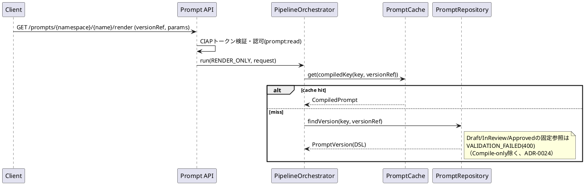

## 5.2 Template展開（Merge / Import）

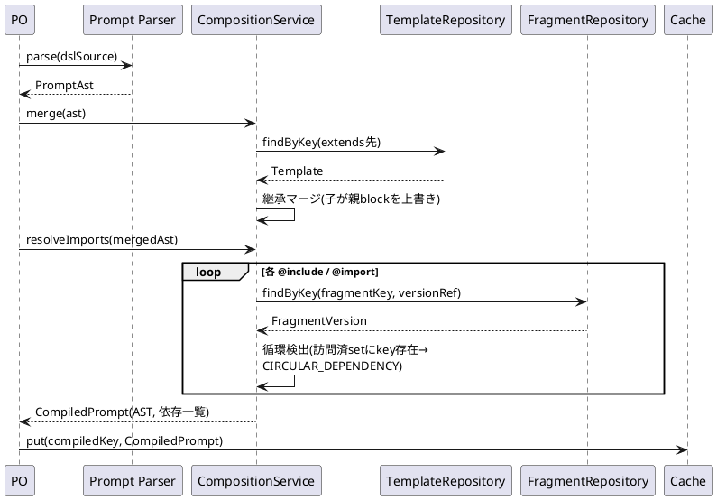

## 5.3 Variable解決

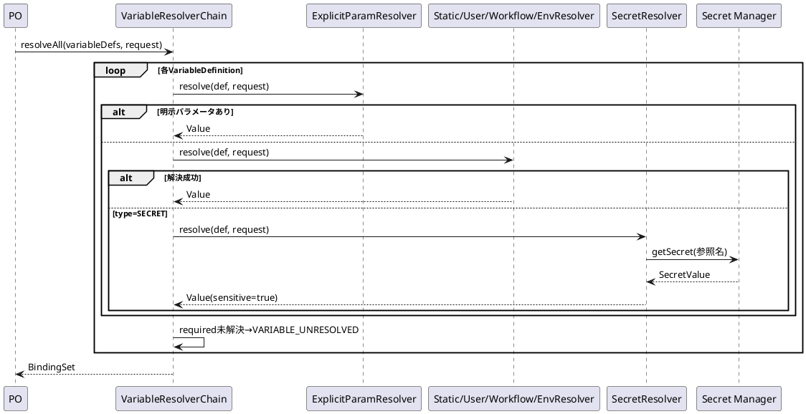

## 5.4 Context解決

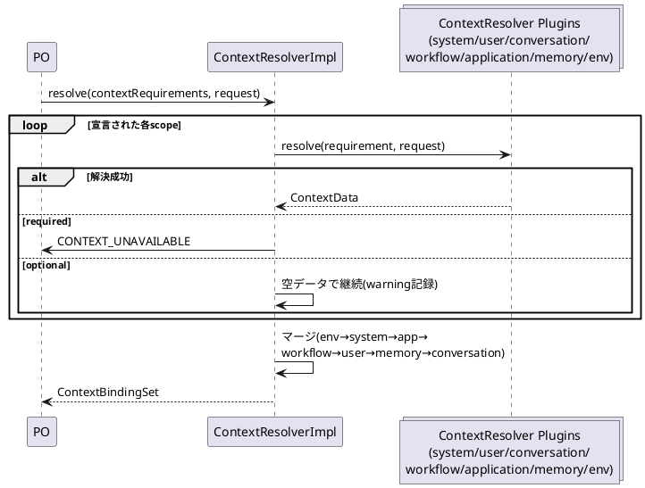

## 5.5 Validation

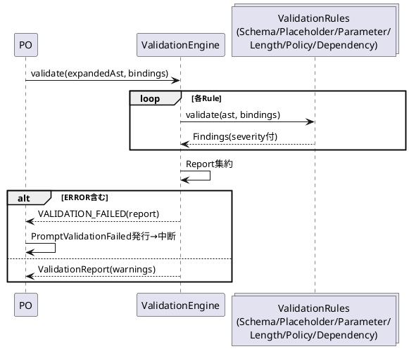

## 5.6 Optimization

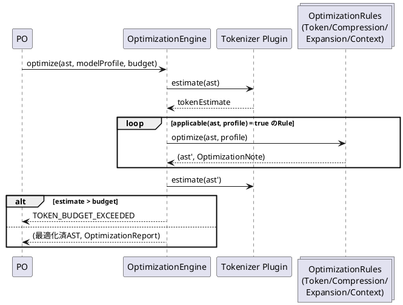

## 5.7 Rendering

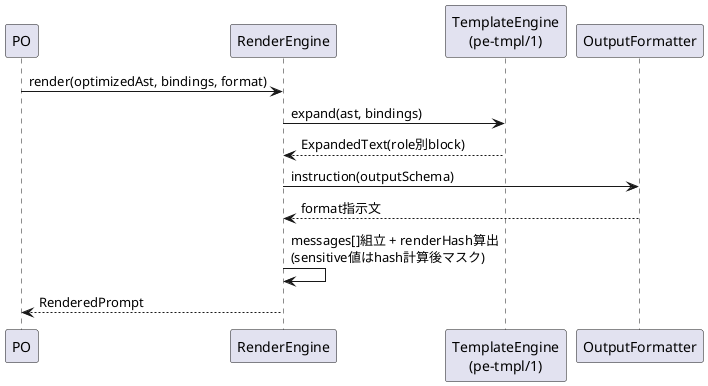

## 5.8 Prompt実行

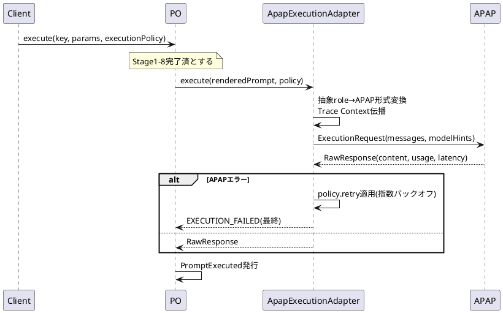

## 5.9 Response Parsing

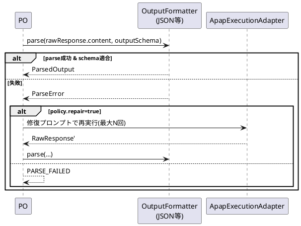

## 5.10 Evaluation

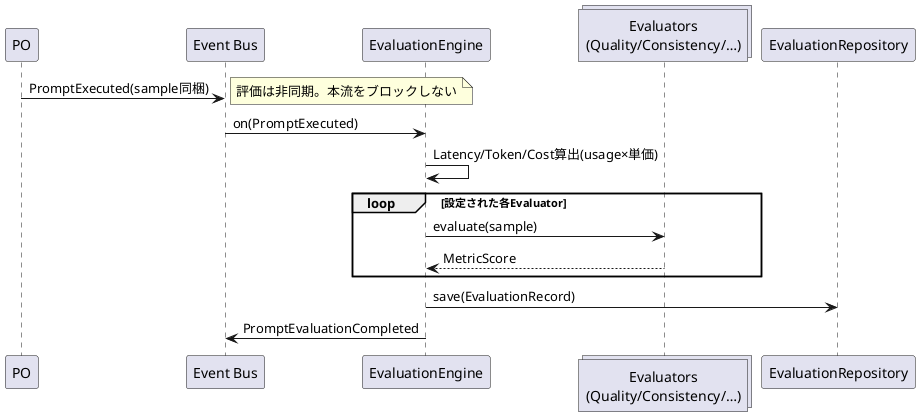

# 6. クラス図（PlantUML）

```plantuml
@startuml
skinparam classAttributeIconSize 0
package domain.prompt {
  class Prompt <<AggregateRoot>> {
    -key: PromptKey
    -category: Category
    -state: LifecycleState
    -versions: List<PromptVersion>
    -aliases: Map<string, SemVer>
    +createVersion(content): PromptVersion
    +submitForReview(v)
    +approve(v, actor)
    +publish(v)
    +rollback(v)
    +deprecate(v)
    +archive()
  }
  class PromptVersion <<Entity>> {
    -version: SemVer
    -content: PromptContent
    -variables: List<VariableDefinition>
    -contextReqs: List<ContextRequirement>
    -status: VersionStatus
    -dependencies: List<DependencyRef>
  }
  class PromptContent <<VO>> { -source: string; -contentHash: string }
  Prompt "1" *-- "1..*" PromptVersion
  PromptVersion *-- PromptContent
}
package domain.template {
  class Template <<AggregateRoot>> { -key; -versions; -parameters }
  class Fragment <<AggregateRoot>> { -key; -versions }
}
package domain.experiment {
  class Experiment <<AggregateRoot>> {
    -variants: List<Variant>
    -traffic: TrafficPolicy
    -status: ExperimentStatus
    +start(); +stop(); +declareWinner(v)
  }
  class Variant <<Entity>> { -name; -promptVersionRef; -weight }
  Experiment "1" *-- "2..*" Variant
}
package engine {
  interface PipelineStage { +execute(ctx) }
  class PipelineOrchestrator { +run(mode, request) }
  interface TemplateEngine
  interface VariableResolver
  interface ContextResolver
  interface ValidationRule
  interface OptimizationRule
  interface EvaluationRule
  interface OutputFormatter
  interface ExecutionAdapter
  class PluginManager { +register(); +resolve(point) }
  PipelineOrchestrator o-- "12" PipelineStage
  PluginManager ..> TemplateEngine
  PluginManager ..> ValidationRule
  PluginManager ..> OptimizationRule
  PluginManager ..> EvaluationRule
}
package infrastructure {
  interface PromptRepository { +save(); +findByKey(); +findVersion() }
  interface PromptCache
  interface SearchEngine
  class ApapExecutionAdapter
  class EventStorePromptRepository
  PromptRepository <|.. EventStorePromptRepository
  ExecutionAdapter <|.. ApapExecutionAdapter
}
PipelineOrchestrator ..> PromptRepository
PipelineOrchestrator ..> PromptCache
PipelineOrchestrator ..> ExecutionAdapter
Prompt ..> PromptRepository : persisted by
Variant ..> PromptVersion : refs
@enduml
```

# 7. コンポーネント図（PlantUML）

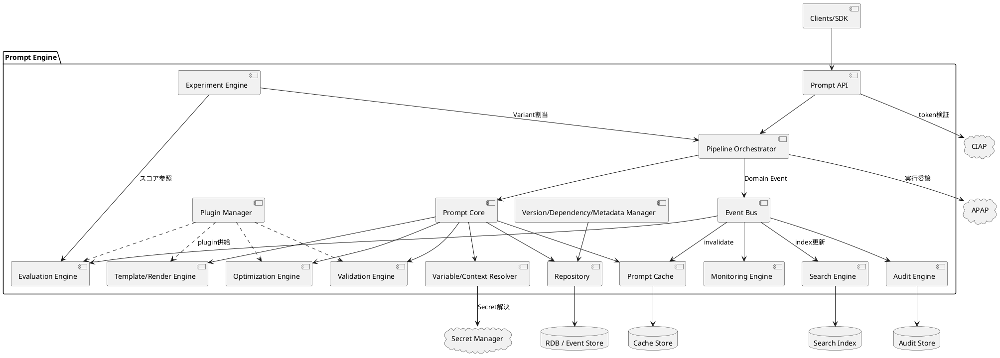

# 8. パッケージ図（PlantUML）

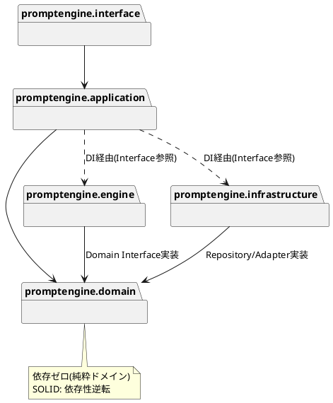

# 9. 状態遷移図（PlantUML）

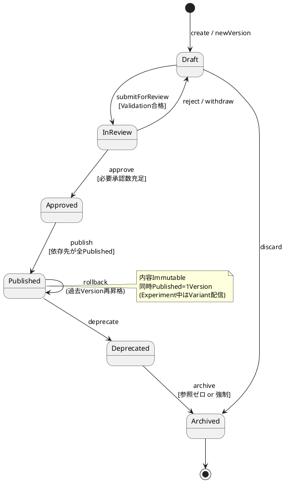

# 10. アクティビティ図（PlantUML）— Prompt Pipeline（Full-execution）

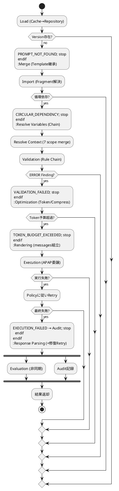

# 11. デプロイメント図（PlantUML）

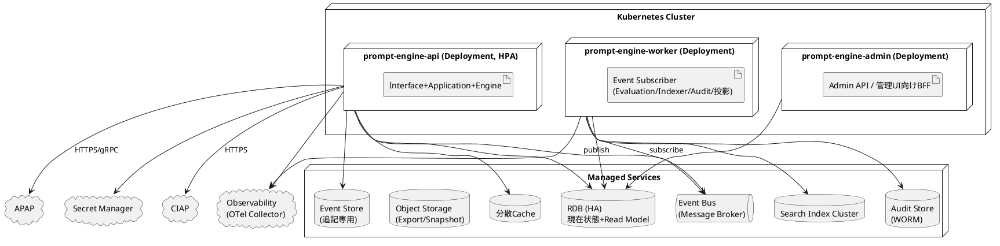

# 12. ER図（PlantUML）

```plantuml
@startuml
hide circle
skinparam linetype ortho
entity prompts {
  * prompt_id : UUID <<PK>>
  --
  * prompt_key : VARCHAR <<UQ>>
  * name : VARCHAR
  category_id : UUID <<FK>>
  description : TEXT
  * state : VARCHAR
  * row_version : BIGINT  ' 楽観ロック用（ADR-0006）
  * created_by / created_at
  * updated_at
}
entity prompt_versions {
  * version_id : UUID <<PK>>
  --
  * prompt_id : UUID <<FK>>
  * version : VARCHAR  ' SemVer
  * content : TEXT     ' DSL
  * content_hash : CHAR(64)
  * status : VARCHAR
  change_note : TEXT
  context_requirements : JSON  ' ContextRequirementの配列。ADR-0006で追加、ADR-0011で複数形化
  extends_key : VARCHAR  ' extends先のTemplateKey（ADR-0009）
  extends_version_range : VARCHAR  ' extendsのVersion範囲（例: "^2"。ADR-0009）
  validation : JSON  ' ValidationSettings（maxLength/maxTokens/policies/placeholders）。ADR-0012で追加
  output : JSON  ' OutputDeclaration（format/schemaRef）。ADR-0015で追加
  * created_by / created_at
  <<UQ prompt_id+version>>
}
entity prompt_aliases {
  * alias_id : UUID <<PK>>
  --
  * prompt_id : UUID <<FK>>
  * alias : VARCHAR   ' stable/canary
  * version_id : UUID <<FK>>
}
entity templates {
  * template_id : UUID <<PK>>
  --
  * template_key : VARCHAR <<UQ>>
  * row_version : BIGINT  ' 楽観ロック用（ADR-0008、promptsのrow_versionと同じ意図）
  * created_by / created_at
  * updated_at
}
entity template_versions {
  * version_id : UUID <<PK>>
  --
  * template_id : UUID <<FK>>
  * version : VARCHAR  ' SemVer
  * body : TEXT
  * content_hash : CHAR(64)
  * status : VARCHAR  ' Draft/Published/Archived（PublicationState、ADR-0008）
  extends_key : VARCHAR  ' extends先のTemplateKey（ADR-0008）
  extends_version_range : VARCHAR  ' extendsのVersion範囲（例: "^2"。ADR-0009）
  * created_by / created_at
  <<UQ template_id+version>>
}
entity template_variable_defs {
  * variable_id : UUID <<PK>>
  --
  * version_id : UUID <<FK>>
  * name / type : VARCHAR
  * source : VARCHAR  ' static/runtime/secret/environment/user/workflow（ADR-0011）
  * required : BOOL
  default_value : TEXT
  constraints : JSON
  * sensitive : BOOL
}
entity fragments {
  * fragment_id : UUID <<PK>>
  --
  * fragment_key : VARCHAR <<UQ>>
  * row_version : BIGINT  ' 楽観ロック用（ADR-0008）
  * created_by / created_at
  * updated_at
}
entity fragment_versions {
  * version_id : UUID <<PK>>
  --
  * fragment_id : UUID <<FK>>
  * version : VARCHAR  ' SemVer
  * body : TEXT
  * content_hash : CHAR(64)
  * status : VARCHAR  ' Draft/Published/Archived（PublicationState、ADR-0008）
  * created_by / created_at
  <<UQ fragment_id+version>>
}
entity fragment_variable_defs {
  * variable_id : UUID <<PK>>
  --
  * version_id : UUID <<FK>>
  * name / type : VARCHAR
  * source : VARCHAR  ' static/runtime/secret/environment/user/workflow（ADR-0011）
  * required : BOOL
  default_value : TEXT
  constraints : JSON
  * sensitive : BOOL
}
entity variable_defs {
  * variable_id : UUID <<PK>>
  --
  * version_id : UUID <<FK>>
  * name / type : VARCHAR
  * source : VARCHAR  ' static/runtime/secret/environment/user/workflow（ADR-0011）
  * required : BOOL
  default_value : TEXT
  constraints : JSON
  * sensitive : BOOL
}
entity dependencies {
  * dependency_id : UUID <<PK>>
  --
  * from_version_id : UUID <<FK>>
  * to_kind : VARCHAR  ' template/fragment/prompt
  * to_key / to_version : VARCHAR
}
entity tags {
  * tag_id : UUID <<PK>>
  * name : VARCHAR <<UQ>>
}
entity prompt_tags {
  * prompt_id : UUID <<FK>>
  * tag_id : UUID <<FK>>
}
entity categories {
  * category_id : UUID <<PK>>
  * name : VARCHAR
  parent_id : UUID <<FK>>
}
entity review_cases {
  * review_id : UUID <<PK>>
  --
  * version_id : UUID <<FK>>
  * status : VARCHAR
  * required_approvals : INT
}
entity approvals {
  * approval_id : UUID <<PK>>
  --
  * review_id : UUID <<FK>>
  * approver / decision : VARCHAR
  comment : TEXT
  * decided_at
}
entity experiments {
  * experiment_id : UUID <<PK>>
  --
  * prompt_id : UUID <<FK>>
  * type : VARCHAR  ' AB/CANARY（BENCHMARKは別Aggregate。ADR-0035で訂正）
  * status : VARCHAR
  * started_at / ended_at
  winner_variant_id : UUID
}
entity variants {
  * variant_id : UUID <<PK>>
  --
  * experiment_id : UUID <<FK>>
  * version_id : UUID <<FK>>
  * name : VARCHAR
  * weight_pct : INT
}
entity golden_datasets {
  * dataset_id : UUID <<PK>>
  --
  * prompt_id : UUID <<FK>>
  * name : VARCHAR
  description : TEXT
  * created_at
}
entity golden_dataset_items {
  * item_id : UUID <<PK>>
  --
  * dataset_id : UUID <<FK>>
  * parameters : JSONB
  * context : JSONB
  expected_output : TEXT  ' Accuracy算出時のみ実質必須。Consistency/Determinismは不要（ADR-0035）
  metadata : JSONB
  * created_at
}
entity benchmarks {
  * benchmark_id : UUID <<PK>>
  --
  * prompt_id : UUID <<FK>>
  * dataset_id : UUID <<FK>>
  * n_repetitions : INT
  * status : VARCHAR  ' Pending/Running/Cancelling/Completed/Cancelled/Failed
  * created_at
  started_at / completed_at / cancelled_at : TIMESTAMPTZ
}
entity benchmark_targets {
  * target_id : UUID <<PK>>
  --
  * benchmark_id : UUID <<FK>>
  * version_id : UUID <<FK>>  ' variantsと異なりweight_pctを持たない（ADR-0035決定1）
}
entity benchmark_metrics {
  * benchmark_id : UUID <<FK>>
  * metric_type : VARCHAR  ' Accuracy/Consistency/Determinism
}
entity benchmark_item_results {
  * result_id : UUID <<PK>>
  --
  * target_id : UUID <<FK>>
  * item_id : UUID <<FK>>
  * status : VARCHAR  ' Pending/Claimed/Completed/Failed
  claimed_at : TIMESTAMPTZ
  claimed_by : VARCHAR  ' Claim+フェンシング（ADR-0025/ADR-0027と同一方式。ADR-0035決定3）
  accuracy_score / consistency_score / determinism_score : DECIMAL
  error_message : VARCHAR
  completed_at : TIMESTAMPTZ
  <<UQ target_id+item_id>>
}
entity evaluation_records {
  * evaluation_id : UUID <<PK>>
  --
  * version_id : UUID <<FK>>
  variant_id : UUID <<FK>>
  * metric_type : VARCHAR
  * score : DECIMAL
  * method : VARCHAR
  sample_ref : VARCHAR
  * evaluated_at
  * event_id : UUID  ' 算出元PromptExecutedのevent_id。UNIQUE(event_id, metric_type)（P10b/V13、ADR-0026決定7）
}
entity execution_logs {
  * execution_id : UUID <<PK>>
  --
  * version_id : UUID <<FK>>
  variant_id : UUID <<FK>>  ' M2-4aで追加（V15、ADR-0034）。Experiment実行時のみ非NULL
  * caller_system : VARCHAR
  * trace_id : VARCHAR
  * latency_ms : INT
  * input_tokens / output_tokens : INT
  * cost : DECIMAL
  * status : VARCHAR
  * executed_at
  * event_id : UUID <<UNIQUE>>  ' 購読側冪等キー（P10b/V13、ADR-0025決定8）
}
entity audit_logs {
  * audit_id : UUID <<PK>>
  --
  * aggregate_type : VARCHAR
  * aggregate_id : UUID
  * action : VARCHAR
  * actor : VARCHAR
  * payload : JSON  ' Secretマスク済
  * trace_id : VARCHAR
  * occurred_at
  event_id : UUID <<UNIQUE>>  ' 購読側冪等キー。CRUD/Pipeline経路はイベントを持たずNULL（P10b/V13、ADR-0026決定7）
}

entity dead_letter_queue {
  * dlq_id : UUID <<PK>>
  --
  event_id : UUID  ' Broker由来のみ。Pipeline Stage 12の退避はNULL
  * event_type : VARCHAR
  * subscriber_name : VARCHAR
  * payload : JSON  ' Secretマスク済
  * failure_reason : VARCHAR  ' 例外クラス名のみ（メッセージ本文は入れない）
  * first_failed_at / last_failed_at
  * retry_count : INT
  * status : VARCHAR  ' PENDING/...。再処理は手動（P10b、ADR-0026決定2）
  ' UNIQUE (event_id, subscriber_name)
}
entity idempotency_keys {
  * idempotency_key : VARCHAR <<PK>>  ' クライアントが送るIdempotency-Keyヘッダの値
  --
  * request_fingerprint : VARCHAR  ' 正規化済みリクエストのSHA-256ハッシュ。同一キー・別内容の再送検知用（P9b）
  * status : VARCHAR  ' IN_PROGRESS/COMPLETED
  result_type : VARCHAR  ' 完了後の結果型（完全修飾クラス名）。COMPLETEDまでNULL
  result_json : JSON  ' 完了後の結果。COMPLETEDまでNULL
  * created_at
  completed_at
}
entity domain_events {
  * event_id : UUID <<PK>>
  --
  * aggregate_type : VARCHAR  ' DomainEvent封筒8項目のうちaggregateType（ADR-0006）
  * aggregate_id : UUID       ' 永続化層サロゲートキー。複数Bounded Context共通のため特定テーブルへのFKは設定しない
  * sequence : BIGINT
  * event_type : VARCHAR
  * actor : VARCHAR           ' DomainEvent封筒のactor（ADR-0006）
  * trace_id : VARCHAR        ' DomainEvent封筒のtraceId（ADR-0006）
  * payload : JSON
  * occurred_at
  <<UQ aggregate_id+sequence>>
}
entity outbox {
  * outbox_id : UUID <<PK>>
  --
  * event_id : UUID <<FK>>
  dispatched_at : TIMESTAMPTZ  ' NULL = 未配信（ADR-0006、Broker中継の実配線は対象外）
  * created_at
}
entity prompt_snapshots {
  * snapshot_id : UUID <<PK>>
  --
  * aggregate_id : UUID <<FK>>
  * sequence : BIGINT   ' 保存時点の domain_events.sequence 最大値
  * state : JSONB       ' 直列化された集約状態（復元用）
  * created_at
  <<UQ aggregate_id+sequence>>
}
prompts ||--|{ prompt_versions
prompts ||--o{ prompt_aliases
prompt_versions ||--o{ variable_defs
prompt_versions ||--o{ dependencies
templates ||--|{ template_versions
template_versions ||--o{ template_variable_defs
fragments ||--|{ fragment_versions
fragment_versions ||--o{ fragment_variable_defs
prompts }o--o{ tags : prompt_tags
categories ||--o{ prompts
prompt_versions ||--o{ review_cases
review_cases ||--o{ approvals
prompts ||--o{ experiments
experiments ||--|{ variants
prompt_versions ||--o{ variants
prompts ||--o{ golden_datasets
golden_datasets ||--o{ golden_dataset_items
prompts ||--o{ benchmarks
golden_datasets ||--o{ benchmarks
benchmarks ||--|{ benchmark_targets
benchmarks ||--o{ benchmark_metrics
prompt_versions ||--o{ benchmark_targets
benchmark_targets ||--o{ benchmark_item_results
golden_dataset_items ||--o{ benchmark_item_results
prompt_versions ||--o{ evaluation_records
variants ||--o{ evaluation_records
prompt_versions ||--o{ execution_logs
variants ||--o{ execution_logs
prompt_aliases }o--|| prompt_versions
prompt_snapshots }o--|| prompts : aggregate_id
outbox }o--|| domain_events : event_id
@enduml
```

---

# 13. API設計（REST）

共通仕様: Base `/api/v1`。認可はCIAP発行のBearerトークン（スコープ: `prompt:read|write|review|approve|publish|execute|admin`, `audit:read`）。相関ヘッダ `X-Trace-Id`。ページング `?page=&size=`（既定20、上限100）。冪等化 `Idempotency-Key`（全POST）。

## 13.1 エンドポイント一覧

`PromptKey`を含むパスは`{namespace}/{name}`という2つの独立したパス変数で表す（単一の`{key}`ではない）。
`PromptKey`が`namespace/name`ちょうど2セグメント必須（§4.4）であるのに対し、Spring MVC等
一般的なフレームワークのパス変数はセグメント境界（`/`）をまたげないため（ADR-0023）。

| Method | Path | 概要 | スコープ | 成功 |
|---|---|---|---|---|
| POST | /prompts | Prompt作成（初版Draft） | write | 201 |
| GET | /prompts | 検索（q, tag, category, status, page） | read | 200 |
| GET | /prompts/{namespace}/{name} | 詳細+Version一覧 | read | 200 |
| PATCH | /prompts/{namespace}/{name} | メタデータ更新 | write | 200 |
| DELETE | /prompts/{namespace}/{name} | Archive（論理削除） | admin | 204 |
| POST | /prompts/{namespace}/{name}/versions | 新Version作成（Draft） | write | 201 |
| GET | /prompts/{namespace}/{name}/versions/{v} | Version内容取得 | read | 200 |
| GET | /prompts/{namespace}/{name}/diff?from=&to= | Version Diff | read | 200 |
| POST | /prompts/{namespace}/{name}/versions/{v}/submit-review | レビュー依頼 | write | 200 |
| POST | /prompts/{namespace}/{name}/versions/{v}/approve | 承認 | approve | 200 |
| POST | /prompts/{namespace}/{name}/versions/{v}/reject | 差戻し（comment必須） | review | 200 |
| POST | /prompts/{namespace}/{name}/versions/{v}/publish | 公開 | publish | 200 |
| POST | /prompts/{namespace}/{name}/rollback | {targetVersion}へ復帰 | publish | 200 |
| POST | /prompts/{namespace}/{name}/versions/{v}/deprecate | 非推奨化 | publish | 200 |
| POST | /prompts/{namespace}/{name}/compile | Compile-only検証（CI用） | read | 200 |
| POST | /prompts/{namespace}/{name}/render | Render-only（1〜8） | read | 200 |
| POST | /prompts/{namespace}/{name}/execute | Full-execution（1〜12） | execute | 200 |
| POST | /prompts/{namespace}/{name}/aliases | エイリアス設定 {alias, version} | publish | 201 |
| GET | /prompts/{namespace}/{name}/dependencies?direction=in\|out | 依存/被依存 | read | 200 |
| GET | /prompts/{namespace}/{name}/evaluations?version= | 評価履歴 | read | 200 |
| POST | /experiments | Experiment作成 | write | 201 |
| POST | /experiments/{id}/start / stop | 開始/停止 | publish | 200 |
| PATCH | /experiments/{id}/traffic | Running中のVariant重み更新（Canary運用、ADR-0034） | publish | 200 |
| GET | /experiments/{id}/results | Variant別スコア・統計判定 | read | 200 |
| POST | /experiments/{id}/promote | 勝者Publish | publish | 200 |
| POST | /prompts/import / GET /prompts/{namespace}/{name}/export | DSLバンドル入出力 | write / read | 200 |
| GET | /audit-logs?aggregateId=&actor=&from=&to= | 監査検索 | audit:read | 200 |
| GET | /metrics/prompts/{namespace}/{name}?from=&to= | Token/Cost/Latency/成功率集計 | read | 200 |
| POST | /plugins / GET /plugins / POST /plugins/{id}/activate | Plugin管理 | admin | 201/200 |

## 13.2 Request / Response例

`POST /prompts/{namespace}/{name}/render`（例: `POST /prompts/support/faq-answer/render`）

```json
// Request
{
  "versionRef": "latest",            // or "1.2.0" or alias "stable"
  "parameters": { "productName": "X1", "tone": "formal" },
  "context": {
    "conversation": { "messages": [ {"role":"user","content":"..."} ] },
    "application": { "channel": "web" }
  },
  "modelProfile": "gpt-class-large", // APAP登録プロファイル参照名
  "options": { "optimize": true, "tokenBudget": 8000 }
}
// Response 200
{
  "promptKey": "support/faq-answer",
  "version": "1.2.0",
  "messages": [
    { "role": "system", "content": "..." },
    { "role": "user", "content": "..." }
  ],
  "outputFormat": "JSON",
  "outputSchemaRef": "schemas/faq-answer-v1",
  "tokenEstimate": 1240,
  "renderHash": "sha256:...",
  "warnings": [],
  "traceId": "..."
}
```

`POST /prompts/{namespace}/{name}/execute` は上記+`executionPolicy {timeoutMs, maxRetries, parseRepair}` を受け、`{ parsedOutput, rawContent, usage {inputTokens, outputTokens, cost}, latencyMs, evaluationId }` を返す。

## 13.3 Error仕様

```json
{
  "error": {
    "code": "VALIDATION_FAILED",
    "message": "required variable 'productName' is not bound",
    "details": [ { "rule": "SchemaValidation", "path": "$.parameters.productName", "severity": "ERROR" } ],
    "traceId": "..."
  }
}
```

| HTTP | code |
|---|---|
| 400 | VALIDATION_FAILED / PARSE_FAILED / INVALID_REQUEST / CIRCULAR_DEPENDENCY / COMPOSITION_LIMIT_EXCEEDED |
| 401 | UNAUTHENTICATED |
| 403 | PERMISSION_DENIED |
| 404 | PROMPT_NOT_FOUND / VERSION_NOT_FOUND / FRAGMENT_NOT_FOUND / TEMPLATE_NOT_FOUND / NOT_FOUND（どの`@RequestMapping`にもマッチしないURL。マッチしたエンドポイント内のエラーではないため他コードとは性質が異なる、ADR-0023） |
| 409 | INVALID_STATE_TRANSITION / VERSION_CONFLICT / DUPLICATE_KEY / IDEMPOTENCY_KEY_CONFLICT（同一Idempotency-Keyで異なるリクエスト内容） / IDEMPOTENCY_KEY_IN_PROGRESS（同一キーが処理中） |
| 422 | VARIABLE_UNRESOLVED / CONTEXT_UNAVAILABLE / TOKEN_BUDGET_EXCEEDED |
| 429 | RATE_LIMITED |
| 502 | EXECUTION_FAILED（APAP起因） |
| 500 | RENDER_ERROR（`RenderFailedException`、Engine/Plugin側の構成不備・実装不具合、ADR-0015） / INTERNAL_ERROR |

`COMPOSITION_LIMIT_EXCEEDED`は`CompositionDepthExceededException`/
`CompositionSizeExceededException`（設計書§2.6ステージ2〜3）に対応する（ADR-0021）。
`MacroRecursionException`は`CIRCULAR_DEPENDENCY`に、`DraftReferenceNotAllowedException`は
`VALIDATION_FAILED`に、`NestedPromptNotSupportedException`は`INVALID_REQUEST`に、
それぞれ既存コードへ便乗させる（ADR-0021、便乗理由の詳細は同ADR参照）。

# 14. イベント一覧

イベント封筒: `{eventId, eventType, occurredAt, aggregateType, aggregateId, actor, traceId, payload}`。Busトピック: `pe.prompt` / `pe.execution` / `pe.evaluation` / `pe.experiment` / `pe.governance` / `pe.plugin`。

Brokerメッセージの本文はこの封筒8項目をそのままJSON化したもの（`payload`は入れ子のJSONオブジェクト）。購読側は`eventType`/`actor`/`traceId`/`occurredAt`を必要とするため、`payload`単体ではなく封筒全体を載せる（P10b、ADR-0026決定1a。P10a時点は`payload`単体だった）。メッセージキーは`aggregateId`、`event-id`ヘッダに`eventId`を載せる（ADR-0025決定7）。

購読側の冪等性: 配信はat-least-onceであり、各購読側が自身の書き込み先テーブルの`event_id`一意制約と`INSERT ... ON CONFLICT DO NOTHING`で重複を吸収する（共有の重複排除テーブルは持たない。ADR-0025決定8）。処理に失敗したイベントは`dead_letter_queue`（§12）へ退避し、オフセットはコミットする（退避済みを再消費し続けると後続が永久に止まるため。ADR-0026決定2）。

P10b時点で実装済みの購読側は5つ: `AuditEngine`（6トピック全て→`audit_logs`）／`ExecutionLogSubscriber`（`pe.execution`→`execution_logs`）／`EvaluationSubscriber`（`pe.execution`→`evaluation_records`、`PromptEvaluationCompleted`発行）／`CacheInvalidationSubscriber`・`SearchIndexSubscriber`（`pe.prompt`）。それぞれ独立したconsumer groupを持つ。

| イベント名 | 発火元 | 主な購読先 | 用途 |
|---|---|---|---|
| PromptCreated | Prompt Aggregate | Search Indexer, Audit | 新規登録の索引化・監査 |
| PromptVersionCreated | Prompt Aggregate | Search Indexer, Audit, Dependency Manager | 依存グラフ更新 |
| PromptUpdated | Prompt Aggregate | Search Indexer, Audit | メタデータ変更反映 |
| PromptReviewRequested | ReviewCase | 通知Subscriber, Audit | レビュー担当への通知 |
| PromptWithdrawn | Prompt Aggregate | 通知Subscriber, Audit | 著者によるレビュー取り下げの記録（ADR-0004） |
| PromptApproved / PromptRejected | ReviewCase | 通知, Audit | 承認記録 |
| PromptPublished | Prompt Aggregate | Cache Invalidator, Search Indexer, Audit, 通知 | 配信切替・キャッシュ無効化 |
| PromptRolledBack | Prompt Aggregate | Cache Invalidator, Audit, 通知 | 障害復旧記録 |
| PromptDeprecated / PromptArchived | Prompt Aggregate | Search Indexer, Cache Invalidator, Audit | 廃止管理（PromptDeprecatedの`reason`が`SUPERSEDED`の場合はpublishによる自動遷移、`MANUAL`の場合は手動deprecate。ADR-0005） |
| PromptDiscarded | Prompt Aggregate | Cache Invalidator, Search Indexer, Audit | Draft破棄の記録（ADR-0004）。P10bでCache Invalidator / Search Indexerを購読先に追加（ADR-0026決定6） |
| TemplateCreated | Template Aggregate | Audit | 新規登録の監査 |
| TemplateVersionCreated | Template Aggregate | Audit | 新Version追加の監査 |
| TemplatePublished | Template Aggregate | Cache Invalidator, Audit | 配信切替・キャッシュ無効化（ADR-0033） |
| TemplateArchived | Template Aggregate | Cache Invalidator, Audit | 廃止の監査・キャッシュ無効化（ADR-0033） |
| FragmentCreated | Fragment Aggregate | Audit | 新規登録の監査 |
| FragmentVersionCreated | Fragment Aggregate | Audit | 新Version追加の監査 |
| FragmentPublished | Fragment Aggregate | Cache Invalidator, Audit | 配信切替・キャッシュ無効化（ADR-0033） |
| FragmentArchived | Fragment Aggregate | Cache Invalidator, Audit | 廃止の監査・キャッシュ無効化（ADR-0033） |
| PromptCompiled | Compiler | Prompt Cache | Compile結果キャッシュ |
| PromptValidated / PromptValidationFailed | Validation Engine | Monitoring, Audit | 品質傾向監視 |
| PromptOptimized | Optimization Engine | Audit | 最適化内容の追跡 |
| PromptRendered | Render Engine | Monitoring | Render回数・時間計測 |
| PromptExecuted | Pipeline Orchestrator | Evaluation Engine, Monitoring, Audit | 非同期評価・使用量集計 |
| PromptExecutionFailed | Pipeline Orchestrator | Monitoring(Alert), Audit | 失敗率監視 |
| ResponseParsed / ResponseParseFailed | Output Formatter | Monitoring, Audit | 構造化出力品質監視 |
| PromptEvaluationCompleted | Evaluation Engine | Experiment Engine, Monitoring | Variant判定入力 |

### P10bで確定した実装上の取り決め（ADR-0026）

- **`PromptExecuted`のpayload**: `{promptKey, semVer, inputTokens, outputTokens, retryCount, latencyMs, costPerToken, status, variantId}`。`semVer`は文字列`"1.0.0"`ではなく**オブジェクト`{major, minor, patch}`**としてシリアライズする（`PromptPublished`等が`SemVer`型をそのまま載せるのと同じ扱い。購読側はこれと`promptKey`から`prompt_versions.version_id`を解決する）。`status`はM1では常に`SUCCESS`（§2.12参照）。`variantId`はM2-4a（ADR-0034）で追加したnullableフィールドで、Experiment経由の実行のみ非NULL（通常経路の実行は`null`）。
- **キャッシュ無効化の発火条件**: `CacheInvalidationSubscriber`は`PromptPublished`に加え`PromptRolledBack`/`PromptArchived`/`PromptDiscarded`、およびM2-3で追加した`TemplatePublished`/`TemplateArchived`/`FragmentPublished`/`FragmentArchived`でも無効化を行う（いずれも配信される内容が実質的に切り替わるため）。
- **M2-3で修正: `aggregateId`ではなく`payload`からキーを復元する（ADR-0033）**: `pe.prompt`には`domain_events`由来のイベントも流れ、その`aggregateId`は`prompts.prompt_id`（`Template`/`Fragment`も同様に自身のDB採番UUID）であり、業務キー（`PromptKey`/`TemplateKey`/`FragmentKey`）としては解釈できない。P10b時点の実装は`aggregateId`を`PromptKey`として解釈しようとし、常に失敗して無音に無効化をスキップしていた（本番相当のイベント形状に対して一度も無効化が成功しない不具合）。M2-3でこれを修正し、各イベントの`payload`が持つ`promptKey`/`templateKey`/`fragmentKey`フィールド（`PromptExecutedPayloadCodec`と同じ、`payload`をJSONとして解析するコーデック経由）からキーを復元する方式に改めた。Template/Fragment publish/archiveについては、復元した`templateKey`/`fragmentKey`と`payload.semVer`を使い、`DependencyRepository`の逆引き（`to_kind`一致）とその`to_version`（`VersionRange`）が`semVer`にマッチするPromptを特定し、該当Promptのキャッシュを無効化する（多段階の依存グラフ探索は行わない。ADR-0033決定3・c参照）。
- **Secretマスクは2層**（§12の`audit_logs.payload`「Secretマスク済」の担保手段）。第1層は型ベースで、`SensitiveValue`を常に`"***"`としてシリアライズするJacksonモジュールをアプリケーション全体の`ObjectMapper`へ登録する（Outboxへ書かれる入口でマスクされるため、下流の購読側は既にマスク済みのJSONを受け取る）。第2層は名前ベースで、保存直前にフィールド名の**後方一致**でredactする。後方一致にしているのは、部分一致だと`inputTokens`/`outputTokens`/`tokenizerId`のような正当なフィールドまでマスクされ監査記録が失われるため。
| ExperimentStarted / ExperimentStopped | Experiment Aggregate | Audit, 通知 | 実験管理 |
| ExperimentWinnerDeclared | Experiment Engine | PromotionService, 通知 | 勝者昇格トリガ |
| ExperimentCompleted | Experiment Aggregate | Audit, Search Indexer | 実験履歴 |
| PluginRegistered / PluginActivated / PluginFailed | Plugin Manager | Audit, Monitoring(Alert) | Plugin運用 |
| CacheInvalidated | Cache Invalidator | Monitoring | 無効化追跡 |

# 15. Prompt DSL仕様

DSLファイルは「YAML Front Matter（メタ定義）+ 本文（Template）」で構成。拡張子 `.prompt`。文字コードUTF-8。

## 15.1 Prompt Template仕様

```
---
pe: "1"                               # DSL仕様バージョン
kind: prompt                           # prompt | template | fragment
key: support/faq-answer
name: FAQ回答生成
category: support
tags: [faq, customer]
engine: pe-tmpl/1                     # Template Engine指定（省略時既定）
extends: templates/base-assistant      # 継承（§15.3）
variables: ...                          # §15.2
context:
  required: [system, user]
  optional: [conversation, memory]
output:
  format: json                         # json|xml|markdown|text
  schemaRef: schemas/faq-answer-v1     # Structured Output用JSON Schema参照
validation:
  maxTokens: 8000                      # §15.7
macros: ...                             # §15.6
---
{{#block system}}
{{> fragments/safety-policy@^2 }}       # Include（§15.5）
あなたは{{ context.application.serviceName }}のサポート担当です。
現在日時: {{ context.system.now }}
{{/block}}

{{#block user}}
製品「{{ productName }}」について{{ tone }}な文体で回答してください。
{{#if conversationSummary}}これまでの経緯: {{ conversationSummary }}{{/if}}
{{#each examples as ex}}
例: {{ ex.q }} → {{ ex.a }}
{{/each}}
{{/block}}
```

構文要素: `{{ expr }}`（値のテキスト置換。エスケープはOutput Formatterが担当）、`{{#if}}/{{else}}/{{/if}}`、`{{#each list as item}}`、`{{#block role}}`（roleはsystem/user/assistant）、コメント `{{!-- --}}`。式はプロパティ参照とパイプフィルタ（`{{ name | upper | truncate(100) }}`）のみ。任意コード実行は不可（インジェクション防止）。

`output:`宣言は`validation:`（§15.7）と同じ扱いで、DSL取り込み時に`OutputFieldMapper`が
`PromptVersion.output: OutputDeclaration?`（`format`/`schemaRef`。`output:`ブロック自体が
宣言されなければ`null`。ADR-0015決定9）へ変換し、`CompiledPrompt`がそのまま引き継ぐ
（Template/Fragmentの`output`とはマージせず、Prompt自身の宣言のみが有効。ADR-0015）。
Pipelineが実際に使う`outputFormat`は「呼出パラメータで明示指定された値 ?:
`CompiledPrompt.output?.format` ?: `TEXT`」の優先順位で決まる。`schemaRef`から`OutputSchema`
実体を解決する経路は未設計（[Issue #36](https://github.com/io0323/prompt-engine/issues/36)）。

## 15.2 Variable仕様

```yaml
variables:
  - name: productName
    type: string                # string|number|boolean|enum|array|object
    source: runtime             # static|runtime|secret|environment|user|workflow
    required: true
    constraints: ["maxLength:100", "pattern:^[^<>]*$"]
  - name: tone
    type: enum
    source: runtime
    required: false
    default: "polite"
    constraints: ["enum:polite,formal,casual"]
  - name: apiKeyRef
    type: string
    source: secret              # 値はSecret Manager参照名。実値はRender直前解決・全ログでマスク
    required: true
    sensitive: true
  - name: examples
    type: array
    source: static
    default: [ { q: "...", a: "..." } ]
```

`source: secret`（`sensitive: true`）の変数はSecret Managerの参照名のみを保持し、
リテラルの`default`を持てない（ADR-0007）。実値はRender直前にSecret Managerから
解決されるものであり、平文の既定値をDSL・DBのいずれにも保持しない。

`constraints`の具体的な文字列表現（`VariableDefinition.constraints: List<String>`）は
`<key>:<value>`形式に統一する（ADR-0012）: `pattern:<regex>` / `min:<number>` /
`max:<number>` / `enum:<comma区切りの値>` / `maxLength:<number>`。未知のキーは
`ParameterValidation`（§2.10）が無視する。

## 15.3 Composition / Inheritance仕様

- `extends: <templateKey>[@versionRange]`: 単一継承のみ。親の `{{#block}}` を子が同名blockで上書き。上書きしないblockは親を継承。`{{ super() }}` で親block内容を子block内に挿入可。
- Nested Prompt: `{{> prompt:other/prompt-key@1 param1=value }}` で他PromptをFragment同様に埋め込み可（Published限定、深さ上限5）。
  **実装状況**: P3c（CompositionService）時点では未実装であり、`target`が`prompt:`で
  始まるIncludeを検出した場合は`NestedPromptNotSupportedException`を投げる
  （ADR-0009決定3で明示的にスコープ外と確認済み、GitHub Issue「Nested Promptを
  実装する」で次フェーズへの回収を追跡）。上記の構文自体は仕様として維持し、
  実装が追いついていないことをここに明記する。
- Composition解決順: extends → import → include → macro展開。この順序は「各宣言単位
  （Prompt/Template自身、およびimport/includeされた各Fragment）が、自身のimport/include
  解決を終えたあとmacro展開まで完了させてから、初めて呼出元／extendsマージへ渡される」
  という**宣言単位ごとの順序**を指す。extendsマージだけは`{{ super() }}`の解決のため
  例外的に2段階に分かれる: `{{ super() }}`（引数無し）を除く各階層自身のmacro呼出は
  extendsマージの**前**に展開し、`{{ super() }}`自体はマージ**後**（block外に残った
  場合は通常の未定義macro呼出として）に解決する。`{{ super() }}`は親block内容の挿入
  であり、それを解決できるのはextendsマージ自身だけであるため、macro展開を1回で
  完結させることができない（実際の解決アルゴリズムはADR-0010「追記」参照）。

多段継承のマージは根本（`extends`を持たないTemplate）から直近の親、そして実際に
コンパイルするPrompt/Templateへ向かって順に行う（ADR-0010）。`{{ super() }}` が
指すのは常に「直近の親が確定した時点でのそのroleのblock内容」（親自身が祖父の
`{{ super() }}` を解決済みの結果を含む）。異常系は以下の通りエラーとする
（ADR-0010、黙って空文字列に展開すると書き手のミスに気づけないため）:

- 親（直近の親として確定している内容）にそのroleのblockが存在しないのに
  `{{ super() }}` を呼んだ場合。根本のTemplate自身が呼んだ場合も同様。
- 同一block内で `{{ super() }}` を複数回呼んだ場合。

`{{#block}}` の外側にあるトップレベルの内容（`TextNode`等）は、extendsマージの
対象外であり、実際にコンパイルするPrompt/Template自身のものだけが最終出力に
含まれる（extendsされることを意図するTemplateは、内容をすべて `{{#block}}` 内に
収める運用とする、ADR-0010）。

## 15.4 Import仕様

```yaml
imports:
  - alias: safety
    ref: fragments/safety-policy@^2    # SemVer範囲。^2=2.x最新Published
  - alias: glossary
    ref: fragments/domain-glossary@1.3.0
```
本文からは `{{> safety }}` で参照。Importは名前空間を導入し、同一Fragmentの多重取込を1回に正規化する。

`imports:`未宣言のFragmentも、`{{> <fragmentKey>[@versionRange] }}` の形で直接参照
できる（§15.5の `<alias|fragmentKey>`）。「多重取込を1回に正規化する」は、同じ
`(FragmentKey, resolvedVersion)` に複数のalias・複数のInclude箇所から到達しても、
そのFragment自身の内部合成（SemVer範囲・Status検証、Fragment自身が持つ
import/include/macro解決）を1回だけ行い結果を再利用する、という意味である
（キー参照グラフDFSのメモ化、ADR-0009決定4）。Include呼出箇所ごとの変数束縛の
適用と出力ASTへの挿入は、呼出箇所ごとに独立して行う（束縛が異なれば挿入内容も
異なるため、これは重複排除の対象ではない。ADR-0010）。

## 15.5 Include仕様

`{{> <alias|fragmentKey>[@versionRange] [k=v ...] }}`。Fragment側で宣言された変数へ `k=v` で束縛（未指定は呼出側スコープを透過継承）。制約: 参照先はPublishedのみ（Compile-onlyモードはDraft可）、循環禁止、深さ上限5、展開後サイズ上限（設定値、既定1MB）。

深さ上限5は、§15.3の解決順（extends → import → include → macro展開）を通した
**解決チェーン全体の通算深さ**を指す（Fragment Include単体の深さではない。ADR-0009）。
P3aのパーサ側ネスト深さ上限（`{{#if}}/{{#each}}/{{#block}}`構文木の入れ子数、既定8）とは
別概念であり、両者は独立して検証・エラー種別化される。

「呼出側スコープを透過継承」の範囲・必須変数未解決時の扱いをADR-0010で明確化する:

- 透過継承の対象は、Fragment側で宣言された変数名のみ（呼出側スコープの
  無関係な変数がFragmentへ漏れ込むことはない）。「呼出側スコープ」とは、
  合成チェーン上でこれまでに宣言された変数名の累積集合（ルートPromptの
  `variables` ∪ extendsチェーン上の各Templateの`variables` ∪ この呼出に至る
  までに展開された外側Fragmentの`variables`）を指す。
- Fragmentの`required: true`変数が、明示束縛にも上記の呼出側スコープにも
  見つからない場合、Compose段階（Stage3）で即座にエラーとする（Compile時に
  構造的に解決不可能と判定できるため。実行時パラメータ欠落による
  Stage4 `VARIABLE_UNRESOLVED`とは別のチェック）。
- Includeの`k=v`束縛・Fragment本体内の変数参照の置換規則（束縛値によるASTの
  構造的な差し替え）はADR-0010参照。

## 15.6 Macro仕様

```yaml
macros:
  - name: bulletList
    params: [items]
    body: |
      {{#each items as i}}
      - {{ i }}
      {{/each}}
```
呼出: `{{ bulletList(items=faqItems) }}`。MacroはPrompt/Template内ローカル定義（共有はFragment化）。再帰呼出禁止。

macroのスコープはPrompt/Template/Fragmentそれぞれの宣言単位に閉じる（ADR-0010）。
Includeで取り込んだFragment内のmacro呼出は、そのFragment自身が`macros:`で
宣言したmacroでのみ解決され、呼出元（Prompt/Template）で定義されたmacroは見えない
（再利用部品が呼出元の定義に依存すると、同じFragmentが文脈によって別の意味に
なり決定性の推論が破綻するため）。宣言単位のどのmacro定義にも一致しない呼出は
エラーとする。再帰検出も同一宣言単位が持つmacro定義集合の中だけで判定する。

macroは、それが記述されたユニット（Prompt/Template/Fragment）内で解決される。
extendsによる継承やincludeによる取り込みで他ユニットの内容が差し込まれた場合も、
差し込まれた内容は元のユニットのmacro定義で解決済みである。したがって親子で
同名macroを定義しても上書き関係にはならず、それぞれの呼出箇所が属するユニットの
定義が使われる（ADR-0010、実際の検証結果は`CompositionServiceImplTest`参照）。

## 15.7 Validation仕様（DSL内宣言）

```yaml
validation:
  maxLength: 32000            # 文字数上限
  maxTokens: 8000             # 推定Token上限（tokenizerはModelProfile依存）
  policies: [no-pii, corporate-tone]   # 登録済Policy Rule ID
  placeholders: strict        # strict=未束縛/未使用を共にERROR, lenient=WARNING
```

このブロックは`PromptVersion`/`CompiledPrompt`の`validation: ValidationSettings`
（`maxLength: Int?`, `maxTokens: Int?`, `policies: List<String>`,
`placeholders: PlaceholderMode`）に対応する（ADR-0012）。省略時の既定値は
無制限・`placeholders: lenient`（既存Promptの挙動を変えないための後方互換な既定）。
Template/Fragmentの`validation`とはマージせず、Prompt自身の宣言のみが有効。

# 16. 拡張ポイント

全拡張はPlugin Manifest（`{id, version, extensionPoint, implementation, config schema, 依存}`）で宣言し、Plugin Managerが検証・活性化・障害隔離（healthCheck失敗でdeactivate+PluginFailed発火、既定実装へフォールバック）を行う。

| # | 拡張ポイント | Interface（§3.4） | 既定実装 | 差替例 |
|---|---|---|---|---|
| 1 | Template Engine | TemplateEngine | pe-tmpl/1 | Jinja系互換エンジン、Mustache互換 |
| 2 | Variable Resolver | VariableResolver | 6種標準Resolver | 外部Config Store連携Resolver |
| 3 | Context Resolver | ContextResolver | 7 scope標準 | ベクトルDB連携Memory Provider |
| 4 | Validation Rule | ValidationRule | Schema/Placeholder/Parameter/Length/Dependency | PII検出、業界規制チェック |
| 5 | Optimization Rule | OptimizationRule | Token/Context最適化 | LLMベース要約Compression |
| 6 | Evaluation Rule | EvaluationRule | Latency/Token/Cost | LLM-as-Judge、埋め込み類似Consistency |
| 7 | Output Formatter | OutputFormatter | JSON/XML/Markdown/Text | 独自スキーマ形式 |
| 8 | Repository | PromptRepository等 | RDB+Event Store | Document Store実装 |
| 9 | Cache | PromptCache | 分散Cache（Redis、M2-3実装、ADR-0033） | ローカル2層Cache |
| 10 | Search | SearchEngine | 全文Index標準 | ベクトル意味検索 |
| 11 | Execution Adapter | ExecutionAdapter | APAP Adapter | テスト用Fake、記録リプレイ |
| 12 | Experiment Strategy | TrafficSplitStrategy | 重み付ランダム+sticky | 多腕バンディット |
| 13 | Tokenizer | TokenizerPlugin | 汎用近似Tokenizer | モデル別正確Tokenizer |
| 14 | Event Bus | EventBusAdapter | 標準Broker Adapter | 他Broker実装 |
| 15 | Benchmark Scoring Rule | BenchmarkScoringRule | 正規化完全一致 | 構造的一致（JSONキー単位）、意味的類似（埋め込み距離） |

Plugin規約: (1) Domain型のみに依存（Infrastructure直接参照禁止）、(2) ステートレス推奨（状態はPluginConfig/外部ストア）、(3) 実行時間上限（既定: Rule系100ms/呼出、超過はタイムアウト打切り+WARNING）、(4) 宣言的権限（Secretアクセス等はmanifestで要求し管理者承認）。

---

## 付録A. トレーサビリティ

| 要求 | 対応節 |
|---|---|
| Prompt Pipeline 12ステージ | §2.6, §5, §10 |
| Context 7種 | §2.7, §5.4, §15.1 |
| Variable 6種抽象化 | §2.8, §5.3, §15.2 |
| Composition 8要素（Template/Fragment/Include/Import/Macro/Inheritance/Composition/Nested） | §15.3–15.6 |
| 評価7指標 | §2.12 |
| 設計対象20コンポーネント | §2.4 |
| ライフサイクル/責務/依存/イベント/拡張ポイント | §2.5 / §2.4 / §8 / §14 / §16 |
